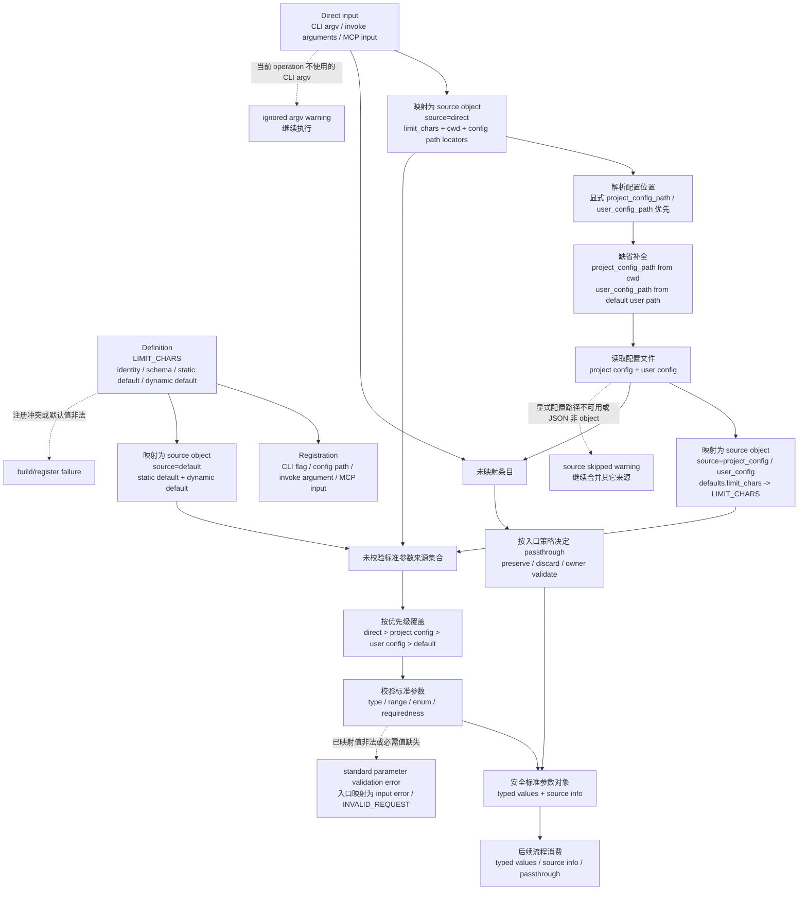

# 标准参数

标准参数机制定义 CLI、配置文件、adapter `invoke` arguments 和 MCP tool input 如何表达同一组导航参数。它的核心行为是：把不同入口的输入映射到同一个标准参数对象，按固定来源顺序合并，完成校验，然后把安全结果交给后续 owner 消费。

本文以“定义与解析流程”为主线。其它章节只补充流程图中每个节点的规则：哪些输入会被映射，配置如何成为来源，未映射字段如何处理，以及 schema、protocol 和 MCP metadata 如何从同一套参数语义派生。

## 行为范围

标准参数机制说明一个参数如何在 CLI、配置文件、adapter `invoke` arguments 和 MCP tool input 中保持同一语义。它定义参数身份、入口字段映射、配置字段映射、来源标记、合并顺序、默认值、透传规则和标准参数校验。

使用方通过 registration 或 metadata 把本入口的输入字段映射到标准参数，得到 typed values、source info、diagnostics 和 passthrough。标准参数机制在返回这些结果后结束；后续流程如何消费结果，由对应 owner 文档说明。

本文只解释标准参数行为。入口生命周期、transport 包装、输出格式、request envelope 和 operation handler 不在本文内重新定义。

## 标准参数模型

标准参数对象不是 argv、config 文件或 protocol request body。它是入口完成映射后的统一语义对象，表示“本次调用最终要使用哪些标准参数值，以及这些值从哪里来”。

从高层看，一个标准参数由四类信息组成：

1. 参数身份：这个值代表什么语义。身份包括 stable identity、canonical key、value kind、schema、默认值和基础校验。
2. 入口字段映射：这个值在不同入口上如何被命名。CLI flag、配置路径、`invoke` argument path 和 MCP tool input path 可以不同，但必须映射回同一个参数身份。
3. 来源标记：映射后的来源对象带有 `direct`、`project_config`、`user_config` 或 `default` 标记。标准参数机制不提供单独的来源开关；某参数不应从某来源取值时，移除该来源对应的映射路径即可。
4. 解析结果：合并校验后的 typed value、每个最终值的 source info、诊断信息和按入口策略保留的 passthrough 字段。

定义新参数时，先确定参数身份，再声明它在哪些入口暴露、各入口字段如何映射，以及未映射字段是否保留。这样新增入口只需要新增入口字段映射，修改校验只需要改参数身份本身。

## 定义与解析流程

下面以 `limit_chars` 为例。流程图是本文的主线，只描述稳定契约，不规定具体实现函数或模块拆分。

### 错误出口

图中虚线是流程中断或诊断位置：

| 位置 | 结果 |
| --- | --- |
| Build/register | Canonical key 指向不同 base identity、静态默认值不满足 schema、registration 缺失或冲突时，注册失败，不进入单次文档操作。 |
| Config source | 默认配置路径缺失表示来源不存在；显式配置路径缺失、不可读、JSON 无效或顶层不是 object 时，跳过该来源并产生 warning，其它来源继续合并。 |
| Direct input shape | `invoke` malformed JSON、request envelope 缺字段或 protocol schema 失败由 protocol owner 返回 failure，不作为标准参数合并错误。 |
| Direct CLI compatibility | 未知 argv、多余 positional、当前 operation 不使用的已知 flag 或 native option 生成 ignored argv warning；实际消费的参数继续进入校验。 |
| Standard validation | 类型、范围、枚举、requiredness 或 default 结果不满足 schema facet 时返回 validation error；CLI 映射为输入错误，`invoke` 映射为 `INVALID_REQUEST`，MCP 交给 handoff owner 包装。 |

## 输入与配置映射

Direct input 是一次调用显式给出的输入，包括 CLI argv、adapter `invoke` request arguments 和 MCP tool input。它们不是三个不同的标准参数机制，只是同一套 registration 在不同入口上的 spelling。映射完成后，direct input 形成 `source=direct` 的来源对象。

| 入口输入 | 映射方式 | 来源对象 |
| --- | --- | --- |
| CLI argv | CLI registration 把 flag 映射到标准参数 identity。 | `source=direct` |
| Adapter `invoke` arguments | Operation argument binding 把 argument path 映射到标准参数 identity。 | `source=direct` |
| MCP tool input | MCP metadata 把 tool input path 映射到标准参数 identity。 | `source=direct` |

没有映射到标准参数 identity 的条目不进入标准参数校验。它们保留在对应来源对象中，后续按入口策略作为 passthrough 保留、丢弃或 owner validate。直接 CLI 需要 ignored argv warning 时，也从这些未被当前 operation 消费的条目中判断和生成；具体 warning 承载仍由输出 owner 定义。

配置是显式输入之外的来源。入口先用 direct input 中的 `project_config_path`、`user_config_path` 和 `cwd` 定位配置；未显式提供 project path 时从 `cwd` 推导，未显式提供 user path 时使用默认用户配置路径。

每个可执行 CLI 或 tool 只读取自己的配置域：

| CLI / tool | 项目级配置 | 用户级配置 |
| --- | --- | --- |
| `docnav` | `.docnav/docnav.*` | 用户配置目录中的 `docnav.*` |
| `docnav-markdown` | `.docnav/docnav-markdown.json` | 默认用户配置目录中的 `docnav-markdown.json` |
| 其他 adapter | `.docnav/<adapter-id>.json` | 默认用户配置目录中的 `<adapter-id>.json` |
| `docnav-mcp` | `.docnav/docnav-mcp.*` | 用户配置目录中的 `docnav-mcp.*` |

配置读取先校验 JSON 顶层 object，再按已注册的配置路径映射字段。Document identity 参数不从配置域读取：`path`、`ref` 和 `query` 只能来自显式输入；`page` 来自显式输入或入口固定默认 `1`。

配置字段只有注册了 config path 才会形成标准参数值。取消某个参数的 config path，就等于该参数不能从配置文件取得；CLI flag、`invoke` argument path 和 MCP input path 也遵循同一规则。

配置只控制所属入口明确声明的行为默认值。配置不得改变 protocol-json 字段、readable-json 字段、MCP structuredContent 字段或稳定错误 code。`docnav config set` 和 `unset` 默认写项目配置；传入 `--user` 时写用户配置。`config list` 不带 path 时列出 core 配置域当前生效值；`config list --path <path> [--operation outline|read|find|info]` 解析文档上下文，并展示该 path 触发的 adapter、core 标准参数来源和最终值。

Adapter direct CLI 配置项目根从启动 cwd 向上查找最近 `.docnav/`；找到时使用其父目录，未找到时使用启动 cwd。Document path 不参与 adapter direct CLI 配置项目根发现。`--project-config-path <path>` 和 `--user-config-path <path>` 只覆盖本次读取的对应配置路径；相对覆盖路径按启动 cwd 解析。

## 合并、透传与校验

标准参数来源固定为 direct input、project config、user config 和 default。Default 来自参数 definition 的 static default 或 dynamic default。解析器按流程图中的优先级覆盖，并保留每个最终值的来源信息。

未映射字段不等同于标准参数错误。未知顶层配置字段、未知 `defaults` 字段、未注册 native option key 或未映射 direct input 字段是否保留，由入口策略决定：可以保留给后续流程，也可以丢弃或交给 owner-specific validation。

共享层只对已映射标准参数执行 schema-backed validation。Passthrough 字段集合可以按同一合并顺序合并 raw path/key；同一 passthrough path 在较靠前来源出现时覆盖较靠后来源，但不参与 typed value validation。

解析器完成后，标准参数层的工作结束。后续模块消费 typed values、source info、diagnostics 和 passthrough；标准参数层不再参与后续执行。

## Metadata 与交接边界

Schema facet 是标准参数定义的一部分，用来表达 value kind、enum、minimum、maximum、description、requiredness 和 default metadata。静态默认值在 build/register 阶段校验；动态默认值在 runtime 产出后进入同一 schema facet 校验。

不同入口可以从同一套参数语义生成不同 metadata view，但这些 view 不互相替代：

- 解析器 schema view：校验最终标准参数值的 type、range、enum、requiredness 和 default 结果。
- Config schema view：表达配置文件可接受字段、字段类型、默认值提示和编辑器校验 metadata。
- Protocol request schema view：校验 request envelope、operation、document path、raw `arguments` object 和已出现已注册标准参数字段的基础 JSON 类型；protocol envelope 仍由 [原始协议](protocol.md) 拥有。
- MCP tool schema view：表达 tool input 的 schema、requiredness、default metadata 和显式输入映射；MCP response packaging 见 [MCP Handoff](mcp.md)。

当标准参数需要跨 protocol 传给 adapter 时，operation argument binding 仅用于把标准参数 identity 映射到 request `arguments` path。跨 protocol 序列化发生在当前入口完成标准参数解析之后；序列化时只写入需要传递的 direct input 字段，以及入口策略明确保留的 passthrough 字段。已解析出的配置值、用户配置值或默认值不会仅因 request construction 被重新分类为 adapter `invoke` direct input。

MCP 是入口形式，不是新的参数语义来源。MCP tool input 可以映射为 CLI argv transport metadata；CLI argv spelling 只是 transport metadata，不是 MCP tool input 的语义来源。推荐由 Rust 生成 JSON artifact 供 JavaScript bridge 消费；runtime metadata 或人工同步也可接受，但必须用映射测试或 artifact/schema diff 防止 stable identity、schema facet 和显式输入映射漂移。

## 维护注意事项

维护标准参数行为时，重点保持这些不变量：

- 同一个 canonical key 在跨 consumer 使用时，必须来自同一个参数身份或 builder factory，并能通过 identity/fingerprint 防止语义漂移。
- 每个入口字段的暴露范围来自 registration 或 tool mapping；参数 definition 不用全局 `.applies_to` 隐式决定所有入口。
- Direct input、project config、user config 和 default 必须先归一为来源对象，再按固定顺序合并；校验发生在合并之后。
- Operation argument binding 是标准参数写入 protocol request `arguments` path 的唯一映射来源。
- Schema views、metadata artifacts 和 examples 是验证材料或打包参考，不是 runtime file dependency；人工同步时要有 schema/example 验证、artifact diff 或映射测试。
- 非 owner 文档只保留消费边界摘要和本文链接，不复制标准参数的来源、合并、透传或校验规则。
