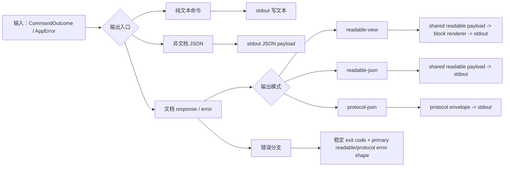
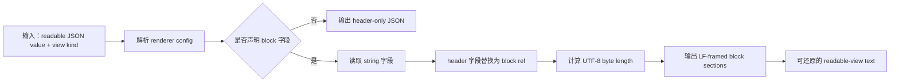
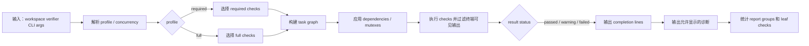
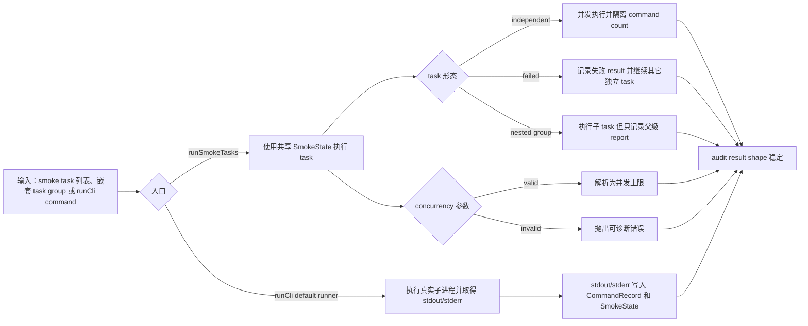
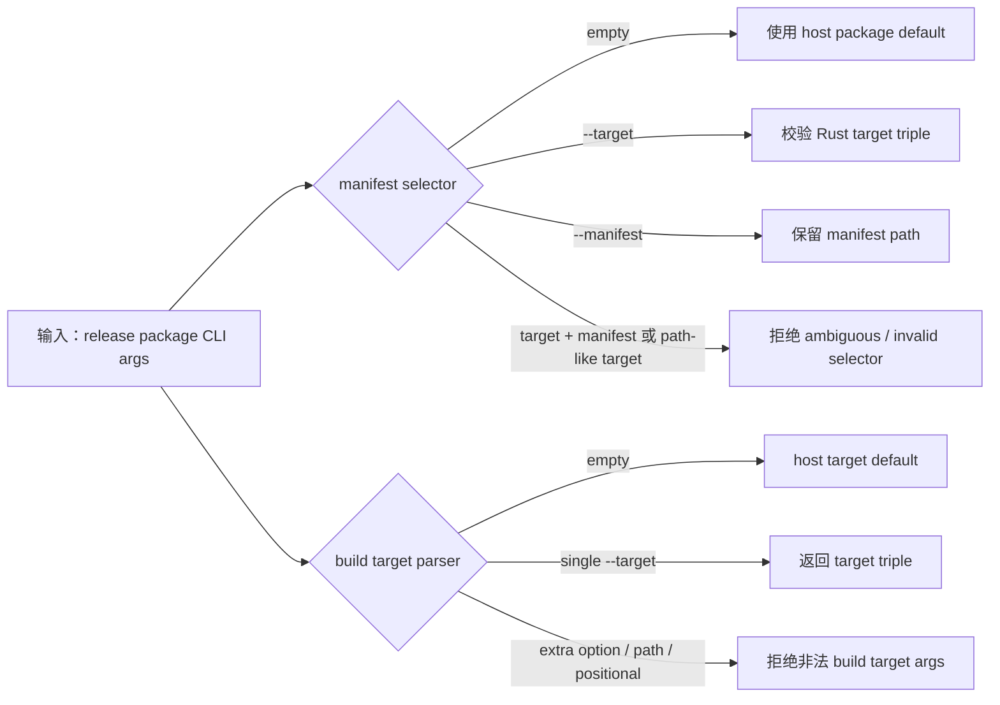

# 测试用例编号账本

## Black-box Cases

### BB-CORE-LINK-001 Core 原样传递真实 Markdown ref
Status: implemented
Existing smoke task: `CORE-LINK-001`
Code: `test/smoke/core/cases/real-markdown.ts`

Proves:
- 真实 `docnav` 进程可以通过 Markdown adapter 完成 `outline -> ref -> read`、`find -> ref -> read` 和 `info` 链路。
- Core 不解析 adapter ref，用户可见 readable JSON 不包含 protocol envelope。

### BB-CORE-REF-001 Adapter ref 错误穿过 Core
Status: implemented
Existing smoke task: `CORE-REF-001`
Code: `test/smoke/core/cases/real-markdown.ts`

Proves:
- 被选中 adapter 拒绝的 ref 会从 core 返回稳定 protocol failure。
- `protocol-json` 承载错误时，stderr 不输出 JSON payload。

### BB-CORE-OUTPUT-001 Core 文档输出模式不混层
Status: implemented
Existing smoke task: `CORE-OUTPUT-001`
Code: `test/smoke/core/cases/outputs.ts`

Proves:
- `readable-json`、显式/默认 `readable-view` 和 `protocol-json` 通过各自包装表达同一文档结果。
- readable success output 只包含对应 operation success payload；failure guidance 通过 readable/protocol error projection 表达。

### BB-CORE-ARGS-001 Core 拒绝缺失的 operation 参数
Status: implemented
Existing smoke task: `CORE-ARGS-001`
Code: `test/smoke/core/cases/cli-args.ts`

Proves:
- document command 缺少本 operation 拥有的必需参数时返回稳定 input failure。
- 该 smoke case 代表这一类外部 CLI 错误，不枚举所有 parser 组合。

### BB-CORE-CONFIG-001 配置优先级和 path context 可观察
Status: implemented
Existing smoke task: `CORE-CONFIG-001`
Code: `test/smoke/core/cases/config-management.ts`

Proves:
- 真实 CLI 边界按文档优先级解析 user、project 和 default config，包括 `defaults.pagination.enabled`、`defaults.pagination.limit` 与 source-level static native option registry 暴露的 `options.max_heading_level`。
- `config list --path` 会报告被选中文档路径对应的 adapter 和 defaults context。
- Config 层只证明 key/source/shape 与来源合并；`options.max_heading_level` 的类型和范围错误由 Markdown adapter-side validation case 证明。
- disabled pagination 在进入 adapter layer request 前归一为最大 positive limit，request 只包含最终 `limit` 和 `page`。
- `defaults.limit` 按 hard switch 被拒绝，并通过 structured `unknown_config_field` / `config_issues` 诊断报告配置来源、路径和字段。

### BB-CORE-SELECT-001 显式 adapter 失败返回 selection diagnostic
Status: implemented
Existing smoke task: `CORE-SELECT-001`
Code: `test/smoke/core/cases/adapter-selection.ts`

Proves:
- 显式选择的 adapter 失败时返回 adapter selection diagnostic，不隐藏为 registry fallback。
- 未显式声明 adapter 的 automatic discovery 全部失败时，candidate failures 从属于 primary diagnostic details。
- 显式 adapter id 不存在时，即使同一请求携带 invalid-looking native option，也返回 adapter selection diagnostic，而不是 option validation error。

### BB-CORE-FAIL-001 Candidate support failure 投影为格式候选摘要
Status: implemented
Existing smoke task: `CORE-FAIL-001`
Code: `test/smoke/core/cases/failures.ts`

Proves:
- candidate discovery 阶段的 built-in adapter support check failure 被报告为 `FORMAT_UNKNOWN` candidate summary。
- candidate failure 不会被折叠成 selected adapter layer failure。

### BB-CORE-SOURCE-001 Historical adapter registry 不参与默认执行来源
Status: implemented
Existing smoke task: `CORE-SOURCE-001`
Code: `test/smoke/core/cases/failures.ts`

Proves:
- 损坏的历史 `.docnav/adapters.json` 不影响 core release 内置 adapter dispatch。
- 默认 document operation 不从 historical registration material、external executable 或 command path 读取 implementation source。

### BB-CORE-TOOLS-001 Core 非 document 命令保持可用
Status: implemented
Existing smoke task: `CORE-TOOLS-001`
Code: `test/smoke/core/cases/config-management.ts`

Proves:
- `init`、`version`、`doctor` 和 document help 能通过真实 CLI 执行。
- 非 document 命令在 smoke 层保持预期输出和退出行为。

### BB-CORE-ADAPTER-MGMT-001 Core adapter inspection 命令覆盖
Status: implemented
Existing smoke task: `CORE-ADAPTER-MGMT-001`
Code: `test/smoke/core/cases/config-management.ts`

Proves:
- `adapter list` 输出 core release static registry 内置 adapter metadata。
- `doctor` 报告 static registry 和 adapter layer 可用性。

### BB-RELEASE-PACKAGE-001 发布包二进制 smoke
Status: planned

Proves:
- release package 内二进制可执行，manifest、文件集合、校验和和 host/target 选择保持一致。
- package smoke 与 release script 参数解析分层。
- 实现触发条件：release package artifact 生成和 package smoke 进入稳定验证入口后，将本 case 改为 `implemented` 并补 `Code:`/`@case`。

## White-box Cases

### WB-CORE-OUTPUT-001 Core 输出编排保持通道边界
Status: implemented
Code: `crates/docnav/src/output/tests.rs`

Proves:
- Core output assembly 分离 protocol JSON、readable JSON、readable view、stdout、stderr 和 exit code 职责。
- 内部编排覆盖 core 文档输出 smoke 中观察到的分支。

### WB-CORE-HELP-001 Core parser help/version 不进入 document output mode
Status: implemented
Code: `crates/docnav/src/cli/parser/tests.rs`

Proves:
- `--help` 和 operation help 返回 typed help command，并展示当前支持的 document output mode。
- help/version 命令保持非 document command，不携带 document output mode。

### WB-CORE-OUTPUTMODE-001 Core parser document output mode 解析稳定
Status: implemented
Code: `crates/docnav/src/cli/parser/tests.rs`

Proves:
- 未显式传入 `--output` 时 parser 不抢先解析默认值，由 document request/config chain 决定。
- `readable-view`、`readable-json`、`protocol-json` 可解析，合法值集合之外的 output value 返回可诊断错误。

### WB-CORE-ARGS-001 Core parser 保持 operation 参数所有权
Status: implemented
Code: `crates/docnav/src/cli/parser/tests.rs`

Proves:
- operation-owned 参数保持严格校验，例如 `outline --page 0` 会暴露 page 边界错误。
- 未被当前 operation 使用的 known argument 不会被抢先 typed 解析，而是在 parser 边界返回 input diagnostic。

### WB-CORE-STDPARAMS-001 Core standard parameter adoption 保持 request construction 来源
Status: implemented
Code: `crates/docnav/src/standard_parameters/tests.rs`

Proves:
- Core document operation request construction consumes standard parameter resolution output, preserving source labels for direct input, project config and built-in defaults.
- Adapter descriptor native CLI flags enter core parsing as native option sources instead of core-owned fields.

### WB-CORE-PREFLIGHT-001 Core preflight 检测 protocol-json intent
Status: implemented
Code: `crates/docnav/src/cli/preflight/tests.rs`

Proves:
- Core preflight 可以在解析失败前识别空格分隔和等号形式的 `--output protocol-json`。
- 该识别只服务错误输出模式选择，不替代正式 parser。

### WB-CORE-ADAPTER-001 Core 校验 adapter contract 对齐
Status: implemented
Code: `crates/docnav/src/registry.rs`

Proves:
- Core static registry 包含 release 内置 Markdown adapter descriptor metadata。
- 内置 adapter descriptor capabilities 与 registry id 保持一致。

### WB-CORE-ADAPTER-SURFACE-001 Core adapter command surface 保持静态注册表边界
Status: implemented
Code: `crates/docnav/src/cli/parser/tests.rs`

Proves:
- `adapter list` 解析为 static registry inspection command。
- `adapter install/register/update/remove` 不再是默认有效 CLI commands。

### WB-CORE-ADAPTER-SOURCE-001 Core adapter selection guidance 保持静态来源边界
Status: implemented
Code: `crates/docnav/src/routing.rs`

Proves:
- 显式声明的 adapter id 不存在于 static registry 时返回 `ADAPTER_UNAVAILABLE`。
- guidance 指向 current core release static registry，不把 `install`、`register`、external executable 或 historical artifact 作为默认修复路径。

### WB-DIAG-RULES-001 Diagnostics primary record rules 保持稳定
Status: implemented
Code: `crates/docnav-diagnostics/src/tests/code_rules.rs`, `crates/docnav-diagnostics/src/tests/record_stack.rs`

Proves:
- DiagnosticCode、category、severity、effect 和 details rule 覆盖所有 current code。
- primary failure diagnostic 的 code、owner、details 和 guidance 保持当前 documented shape。

### WB-CLIARGS-BOUNDARY-001 Strict CLI 参数扫描保持输入边界
Status: implemented
Code: `crates/docnav-cli-args/src/tests.rs`

Proves:
- unknown flag 不消费后续 positional，used value flag 保留值，unused value flag 记录 operation applicability failure。
- switch flag、missing value、extra positional 和 unknown token 边界保持可观察，并可映射为 input diagnostic。

### WB-JSONIO-WRITE-001 JSON writer 保持格式和错误分类
Status: implemented
Code: `crates/docnav-json-io/src/tests.rs`

Proves:
- compact/pretty JSON 都以换行结束。
- serialization failure 和 writer failure 保持不同错误类型。

### WB-OUTPUT-DOCUMENT-001 共享 document output facade 分层
Status: implemented
Code: `crates/docnav-output/src/tests.rs`

Proves:
- readable JSON success 不带 protocol envelope，protocol JSON success 只输出 protocol envelope。
- readable-view read 使用 block renderer，readable error 保留 primary diagnostic code、owner、details 和 guidance。

### WB-READABLE-RENDERER-001 Readable renderer success path block/framing 规则
Status: implemented
Code: `crates/docnav-readable/src/renderer/tests/success.rs`

Proves:
- readable-view header、block replacement、UTF-8 byte length、LF framing、extension fields 和 operation-specific block/no-block config 保持稳定。
- readable error payload、header standalone JSON 和 default config success path 保持可还原。

决策说明:
- `to_readable_value` 当前证明目标限定为有效 typed payload -> readable JSON value。serialization failure 需要人工构造 failing `Serialize` 才能触发，不登记为独立证明目标；若 production readable payload 引入非平凡序列化失败风险，再新增窄单测覆盖该分支。

### WB-READABLE-RENDERER-002 Readable renderer config/error 边界稳定
Status: implemented
Code: `crates/docnav-readable/src/renderer/tests/errors.rs`

Proves:
- renderer 可以区分 missing pointer、non-string target、duplicate pointer 和 pointer syntax。
- renderer failure 使用稳定 error id `readable_view_render_failed`。

### WB-READABLE-VIEW-001 Readable-view conformance vectors 被测试消费
Status: implemented
Code: `crates/docnav-readable/tests/conformance_tests.rs`

Proves:
- readable-view conformance fixture set 由测试执行，保持 fixture 与 renderer contract 同步。
- renderer framing、block extraction、readable error projection 和 extension-field case 由 fixture-driven assertions 覆盖。

### WB-PROTO-BASIC-001 Protocol 基础类型和 envelope 规则稳定
Status: implemented
Code: `crates/docnav-protocol/src/tests/basic.rs`

Proves:
- positive integer、generated request id、success response 和 failure operation preservation 保持协议基础不变量。
- protocol diagnostic code category 映射保持共享分类稳定。

### WB-PROTO-DECODE-001 Protocol request decode 按阶段失败
Status: implemented
Code: `crates/docnav-protocol/src/tests/decode.rs`

Proves:
- Protocol request decoding 先运行 typed-field contract validation，再进入 typed deserialization。
- field-contract-invalid、typed-invalid 和 semantic-invalid request/probe/response 保持可区分。
- request operation/arguments pairing 和 response operation/result pairing 保留在 semantic validation 阶段。

### WB-PROTO-SCHEMA-001 Protocol fixtures 和 schema constraints 被实现测试消费
Status: implemented
Code: `crates/docnav-protocol/src/tests/schema.rs`

Proves:
- 已文档化的 protocol fixtures 仍能通过 public JSON Schema、runtime typed contract validation，并 deserialize 为共享 protocol types。
- protocol request、protocol response、manifest 和 probe 的 unknown fields、missing required fields、wrong types、version constants、field constraints 和 semantic boundary 被实现测试消费。

### WB-TYPED-FIELDS-001 Typed field definition core 保持字段级不变量
Status: implemented
Code: `crates/docnav-typed-fields/src/tests/field_model.rs`

Proves:
- Builder 生成 field identity、processing strategy-backed structured path、`FieldValidation<T>`、typed default metadata 和 schema metadata view，并能把合法 JSON value 校验为 typed value。
- Field metadata validation 区分 missing optional、wrong type 和 range violation，并保留 field identity、field path 和 machine-readable reason。
- Required enum field declaration 使用 Rust enum metadata 校验 allowed value，missing required 和 disallowed enum value 返回可诊断 validation failure。

### WB-TYPED-FIELDS-PRESENCE-001 Typed field declaration presence policy 稳定
Status: implemented
Code: `crates/docnav-typed-fields/src/tests/field_presence.rs`

Proves:
- `T` / `Option<T>` field declaration 分别投影为 required/non-nullable 和 optional/nullable schema metadata。
- missing required 和 null required 分别返回 `MissingRequired` 与 typed wrong-null failure。
- optional field 在 missing、null 和 present 三种输入下分别产生 `None`、`None` 和 typed value。
- 手动 field shape 可表达 required-but-nullable contract field，missing 仍失败，present null 可通过。

### WB-TYPED-FIELDS-METADATA-001 Typed field metadata build invariants 稳定
Status: implemented
Code: `crates/docnav-typed-fields/src/tests/field_metadata.rs`

Proves:
- duplicate field identity 在 definition set build 阶段失败，并保留 previous/current declaration path 和 processing path。
- String enum metadata 由真实 Rust enum metadata 驱动：空 enum metadata 在 build 阶段失败，重复 enum string alias 在有效 metadata 中去重，typed extraction 返回 enum value。

### WB-TYPED-FIELDS-CONSTRAINTS-001 Typed field string/array constraints 稳定
Status: implemented
Code: `crates/docnav-typed-fields/src/tests/constraints.rs`

Proves:
- String regex、closed minimum length 和 open maximum length 对 present value 产生稳定 validation failure reason。
- Array length 和 unique-items constraints 对 present value 生效。
- Invalid regex metadata 在 definition set build 阶段失败。

### WB-TYPED-FIELDS-RANGES-001 Typed field numeric ranges and defaults 稳定
Status: implemented
Code: `crates/docnav-typed-fields/src/tests/field_ranges.rs`

Proves:
- Numeric range 按字段 Rust value type 绑定：`int()` 使用 integer bound 并覆盖大整数精度边界，`num()` 使用 finite floating bound；open/closed empty range 在 build 阶段失败。
- Static default metadata 通过 field validation；invalid default、non-finite default、non-finite range、empty range 和 missing processing strategy 在 build 阶段失败。

### WB-TYPED-FIELDS-PROCESSING-001 Typed field processing build 稳定
Status: implemented
Code: `crates/docnav-typed-fields/src/tests/processing.rs`

Proves:
- Processing build 接受 processing id 和 caller-provided function，可以用 typed raw input 返回 caller processing result；typed-fields 不解释处理函数内部语义。
- Empty processing id 在 build 阶段失败。

### WB-TYPED-FIELDS-PROJECTION-001 Typed field definition set projection 稳定
Status: implemented
Code: `crates/docnav-typed-fields/src/tests/set_projection.rs`

Proves:
- FieldDefSet 汇总字段定义，`#[derive(FieldDefs)]` 的 Rust struct 生成 typed values object shape，`#[field(group)]` 表达嵌套对象。
- JSON helper 组合 FieldDefSet metadata/validation，在同一 processing id 下返回 extraction result 和 processing result；即使 extraction result 为 validation error，processing result 仍可交给 caller，未配置 passthrough processing 时保留原始 JSON，并可按 declared JSON path 计算当前 object 的未消费键。
- 处理入口和投影 API 产出同形 typed values object、value kind view、typed default values object 和 schema metadata view；`process_with_static_defaults(processing, json)` 只用 static default 填补缺失输入，`default_values()` 对缺少 static default 的 leaf 返回 `None`，`to_builder()` 支持静态覆盖 leaf builder 后重新 build，动态 identity-string field lookup 不属于 API。
- Field builder 可以按 processing id 声明处理策略且不再支持 `.path(...)` 兼容入口；同一 definition set 内相同 processing id 必须使用相同 input kind，JSON path processing strategy 可以产出同形 typed values object。

### WB-TYPED-FIELDS-COMPILE-001 FieldDefs derive 拒绝非法声明
Status: implemented
Code: `crates/docnav-typed-fields/tests/field_defs_compile.rs`

Proves:
- `FieldDefs` derive 在编译期拒绝 leaf Rust field 类型与 `FieldDefBuilder<T>` 类型不一致的声明。
- 缺少 field validation 或缺少 `#[field(...)]` attribute 的声明无法通过 trybuild compile-fail fixtures。

### WB-STDPARAMS-RESOLVE-001 Standard parameter resolver 保持来源解析边界
Status: implemented
Code: `crates/docnav-standard-parameters/src/tests.rs`

Proves:
- Standard parameter resolver consumes typed-field metadata to produce typed runtime values with source info, using fixed `direct input > project config > user config > default` priority.
- Processing-specific metadata projection and standard parameter registration bindings construct direct input, project config, user config and default sources before resolution.
- Missing required values, invalid mapped values, optional mapped JSON null, static defaults and dynamic default source values all pass through typed-field validation and do not expose unsafe typed values.
- Explicit or present invalid config sources return blocking config diagnostics while default missing config sources remain absent without diagnostics.
- Unmapped public input returns source-scoped blocking diagnostics；owner-scoped native option sources can be delegated to adapter/native option owner with source info preserved.
- Source-level static native option registry preserves owner/namespace/type variants, including same option name across multiple owners or value kinds, and generic merge does not collapse them into a single core type.
- Core standard parameter resolution hands off final native option values without selected-adapter filtering or type/range prevalidation.
- Operation argument binding records identity-to-arguments-path metadata while preserving the resolved source info; request construction remains outside the resolver.

### WB-CONTRACTS-ERROR-001 Adapter contracts error mapping 保持 protocol 投影
Status: implemented
Code: `crates/docnav-adapter-contracts/src/lib.rs`

Proves:
- 默认 unsupported operation 通过 adapter contract 映射为 `CAPABILITY_UNSUPPORTED` protocol error。
- Adapter error exit category、owner 和 stable details 不依赖 direct adapter CLI 或 adapter subprocess。

### WB-NAVIGATION-DISPATCH-001 Navigation request construction and adapter dispatch 稳定
Status: implemented
Code: `crates/docnav-navigation/src/lib.rs`

Proves:
- `docnav-navigation` 将 core operation input 映射为 protocol request arguments。
- 缺失 operation-owned input 在 navigation boundary 返回 typed input error。
- Adapter library handle dispatch 返回 protocol success/failure envelope，不需要 adapter subprocess。

### WB-MD-REF-GRAMMAR-001 Markdown ref grammar 稳定
Status: implemented
Code: `crates/docnav-markdown/src/markdown/refs/tests.rs`

Proves:
- canonical heading ref 由 line 和 level 结构字段构成。
- parser 将前导零、非法 level、非数字字段、grammar 外格式和错误 prefix 映射到 grammar 外输入。
- `doc:full` sentinel 仍作为 adapter-owned full document ref 保留。

### WB-MD-REF-MATCH-001 Markdown parsed ref 精确匹配 heading 坐标
Status: implemented
Code: `crates/docnav-markdown/src/markdown/refs/tests.rs`

Proves:
- parsed heading ref 在 line 和 level 同时匹配时命中目标 heading。
- matcher 的命中条件由 parsed ref 的 line 和 level 决定。

### WB-MD-PARSE-001 Markdown parser 忽略非 heading 结构
Status: implemented
Code: `crates/docnav-markdown/src/markdown/tests.rs`

Proves:
- code fence pseudo heading、invalid heading 和 frontmatter 不进入 heading model。
- section boundary 按 Markdown heading 层级截断。

### WB-MD-OUTLINE-001 Markdown outline ref 和 display 语义稳定
Status: implemented
Code: `crates/docnav-markdown/src/markdown/tests.rs`

Proves:
- outline 生成 canonical ref，重复 title/path 不影响 ref，max heading level 只影响可见性。
- deep-only document 在当前可见层级下 fallback 到 `doc:full`。
- outline display 保留 title/cost，但 ref 不包含展示文本。

### WB-MD-ADAPTER-OUTLINE-001 Markdown adapter outline 默认层级和 fallback 稳定
Status: implemented
Code: `crates/docnav-markdown/tests/adapter/outline_ref.rs`

Proves:
- adapter outline 默认显示 H1-H3，并忽略 code fence 内 heading 和超出默认层级的 heading。
- 没有 visible heading 时 fallback 到 `doc:full`，且 read 能返回完整文档。

### WB-MD-READ-001 Markdown read resolve 和 doc:full ref 稳定
Status: implemented
Code: `crates/docnav-markdown/src/markdown/tests.rs`

Proves:
- canonical ref 可解析到 heading，`doc:full` 可解析完整文档。
- 符合 canonical grammar 但缺少匹配项的 ref 返回 `REF_NOT_FOUND`。
- grammar 外输入返回 `REF_INVALID`。

### WB-MD-LINK-001 Markdown outline/find ref 可通过 read roundtrip
Status: implemented
Code: `crates/docnav-markdown/src/markdown/tests.rs`

Proves:
- Markdown navigation 生成的 outline entry ref 可以直接传给 read。
- find 生成的 ref 也可通过同一本地 parser/formatter 路径解析。

### WB-MD-REF-001 Markdown 重复标题生成唯一可读 ref
Status: implemented
Code: `crates/docnav-markdown/tests/adapter/outline_ref.rs`

Proves:
- 重复 heading path 会生成唯一 ref，且每个 ref 都能读取目标 section。
- Markdown ref generation 和 read lookup 仍由 adapter 拥有。

### WB-MD-REF-002 Markdown ref 错误区分 invalid 和 not-found
Status: implemented
Code: `crates/docnav-markdown/tests/adapter/outline_ref.rs`

Proves:
- grammar 外输入返回 `REF_INVALID`。
- 符合 canonical grammar 且当前结构缺少匹配 section 的 ref 返回 `REF_NOT_FOUND`。
- 文档结构变化后的先前 ref 由当前结构重新判定。

### WB-MD-PAGE-001 Markdown read 分页按 Unicode 字符计数
Status: implemented
Code: `crates/docnav-markdown/tests/adapter/paging_find.rs`

Proves:
- Markdown read pagination 按 Unicode 字符计数，不拆分字符。
- page 前进和结束状态可通过返回的 page metadata 观察。

### WB-MD-PAGE-002 Markdown outline/find pagination 保持 continuation
Status: implemented
Code: `crates/docnav-markdown/tests/adapter/paging_find.rs`

Proves:
- outline 和 find 结果按 response page 继续读取直到结束。
- past-end page 返回空结果且不产生 continuation。

### WB-MD-PAGING-DISPLAY-001 Markdown paging helper 保留 ref 并截断 display
Status: implemented
Code: `crates/docnav-markdown/src/paging/tests.rs`

Proves:
- Markdown paging helper 对 Unicode 计数一致。
- display 预算不足时截断 display 而不截断 ref，并在有空间时保留 ellipsis marker。

### WB-MD-FIND-001 Markdown find ref 和 display 语义稳定
Status: implemented
Code: `crates/docnav-markdown/tests/adapter/paging_find.rs`

Proves:
- find 匹配 hidden heading 或 heading 前内容时，ref 指向当前 visible region 或 full document fallback。
- find display 保留匹配片段且 ref 不受 display 内容影响。

### WB-MD-OPTIONS-001 Markdown adapter-owned options 控制可见粒度
Status: implemented
Code: `crates/docnav-markdown/tests/adapter/options_error_display.rs`

Proves:
- `max_heading_level` options 同时影响 outline 和 find 的 visible heading granularity。
- `max_heading_level` 通过 source-level static native option registry 进入 generic merge，options shape 保持 adapter-owned，不上移为 core-owned 字段。
- Markdown adapter consumes the final selected option value and returns adapter-owned diagnostics for type mismatch or values outside `1..6`.

### WB-MD-META-001 Markdown manifest/probe/info 元数据稳定
Status: implemented
Code: `crates/docnav-markdown/tests/adapter/meta.rs`

Proves:
- manifest 声明 Markdown v0 capabilities，probe 返回 format evidence 而不泄漏 navigation payload。
- info 返回 Markdown summary 和 capabilities。

### WB-MD-ERROR-001 Markdown adapter document error 稳定
Status: implemented
Code: `crates/docnav-markdown/tests/adapter/options_error_display.rs`

Proves:
- non-UTF-8 document 返回稳定 encoding error。
- 结构快照 ref 在文档变化后返回 `REF_NOT_FOUND` 而非 `REF_INVALID`。

### WB-MD-DISPLAY-001 Markdown outline/find display 保留可读文本
Status: implemented
Code: `crates/docnav-markdown/tests/adapter/options_error_display.rs`

Proves:
- outline display 包含 heading title，find display 包含 match snippet。
- display 不进入 ref，不影响 adapter-owned ref 语义。

## Auxiliary Script Cases

### AUX-WORKSPACE-VERIFY-001 Workspace verifier 保持 required/full profile 语义
Status: implemented
Code: `scripts/docnav-workspace/verify.test.ts`

Proves:
- required 和 full verifier profile 保持区分。
- profile membership、check label、arguments、dependencies、mutex 和 report counting 由 verifier tests 明确证明。
- required profile 显式包含 case catalog docs validator 和 validator script tests。
- required profile 包含 quick quality check；full profile 使用 full quality check 替代 quick quality check，并追加更宽验证。
- full profile 的 quality check 使用 verifier 输出；只有未带 `acceptedReason` 的 quality warning 会映射为 verifier warning。
- completion line 和 summary 可区分 passed、warning 和 failed。
- 输出过滤规则由 verifier 配置维护；终端输出保留状态摘要和可行动诊断，完整子命令输出写入 verifier log。

### AUX-SMOKE-HARNESS-001 Smoke harness 正确记录 task 和 command 输出语义
Status: implemented
Code: `test/tools/smoke-harness.test.ts`

Proves:
- independent smoke tasks 可以并发运行，同时 command count 按 report 隔离。
- failed task、nested task group、默认 runner 的 stdout/stderr command record 和 concurrency validation 保持预期 audit result shape。
- core smoke repository temp root 在运行前创建并在运行结束后清理；清理失败或残留不得改变 command output contract。

### AUX-PARALLEL-RUNNER-001 Parallel task runner 保持调度契约
Status: implemented
Code: `scripts/tools/parallel-task-runner/index.test.ts`

Proves:
- task normalization、concurrency、mutex serialization、dependency ordering 和 nested task expansion 保持稳定。
- prepare strategy、invalid list metadata、duplicate id 和 unknown dependency failure 保持可诊断。

### AUX-QUALITY-PARSER-001 Quality scanner parsers 保持 fixture 语义
Status: implemented
Code: `scripts/tools/quality/measurement/scanners.test.ts`

Proves:
- quality scanner wrapper 仍能解析预期的 scc、Lizard 和 PMD CPD output shape。
- PMD CPD exit 4 没有 XML 时不被误判为空扫描成功。

### AUX-QUALITY-CACHE-001 Quality measurement cache identity 稳定
Status: implemented
Code: `scripts/tools/quality/measurement/cache.test.ts`

Proves:
- duplicate-code cache key 由 scan identity、tool args、config、code area 和 input fingerprint 决定。
- duplicate-code cache entry 使用 `.cache/docnav/quality/<scan_cache_version>/` 作为 owner 目录。
- cache hit 返回不带 changed-scope annotation 的 metric，保持复用扫描与当前 diff 语义分离。
- baseline snapshot cache key 由 baseline commit、scan config 和工具版本决定，命中时通过 snapshot hash 防止错读缓存内容。

### AUX-QUALITY-CPD-TASK-001 Quality CPD task planning 稳定
Status: implemented
Code: `scripts/tools/quality/measurement/scanners/pmd-cpd/area-scans.test.ts`

Proves:
- PMD CPD 每个 code area 生成一个 scan task。
- task id 和文件排序保持可复现。

### AUX-QUALITY-FINGERPRINT-001 Quality input fingerprint 稳定
Status: implemented
Code: `scripts/tools/quality/input/files.test.ts`

Proves:
- quality input fingerprint 使用排序后的文件内容生成稳定 SHA-256。
- 文件内容变化会改变 fingerprint，文件顺序变化不会改变 fingerprint。

### AUX-QUALITY-GIT-PATHSPEC-001 Quality git pathspec 参数稳定
Status: implemented
Code: `scripts/tools/quality/input/files.test.ts`

Proves:
- quality input git pathspec 参数使用显式 `--` 分隔并保留 glob pathspec magic。
- 空 pathspec 可按调用方需要保留 `--` 或完全省略。

### AUX-QUALITY-CODE-AREAS-001 Quality code area 分类稳定
Status: implemented
Code: `scripts/tools/quality/model/code-areas.test.ts`

Proves:
- smoke case 和 fixture 文件归入 `fixtures-examples`，不被 `typescript-validation-smoke` 的广泛 globs 遮蔽。
- smoke harness 和 validator infrastructure 仍归入 `typescript-validation-smoke`。
- quality scan input globs 只覆盖 TypeScript 脚本源码。

### AUX-QUALITY-REPORT-001 Quality report 排名和 changed-file 摘要稳定
Status: implemented
Code: `scripts/tools/quality/output/report/markdown-report.test.ts`

Proves:
- baseline unavailable 时 changed-file watchlist 仍按风险展示有用文件。
- rankings 排序不修改 scanner output 原始顺序。
- scc `Complexity` 文件列在人类报告中展示为 decision-token count，并补充 `file-decision-tokens / total-file-decision-tokens` 热点占比。
- Code Area 汇总表展示 decision-token count 和总量占比，用于定位热点区域。
- 带 `acceptedReason` 的 warning 在报告中贴近对应 warning 展示原因，不从单独质量扫描中消失。

### AUX-QUALITY-WARNINGS-001 Quality warning 阈值语义稳定
Status: implemented
Code: `scripts/tools/quality/output/warnings/generator.test.ts`

Proves:
- 文件大小 warning 使用 scc `Code` 代码行数，而不是包含注释和空行的总行数。
- 文件大小 warning 根据 scc decision-token count 选择 code-line floor，低 decision-token 文件可使用更高行数阈值。
- warning record 的 rule id、metric、message 和 suggestion 反映代码行数语义，且 suggestion 不直接把行数信号转成拆分建议。
- 函数 warning 使用复杂度感知的代码密度阈值：普通复杂度函数超过 50 行触发，CC < 5 的简单函数超过 150 行才触发。
- 函数代码密度 warning record 的 rule id、metric 和 message 反映组合阈值语义，不再输出单纯函数代码行数规则。
- 已知可接受 warning 保留在 all/changed/regression warning records 中，并通过 `acceptedReason` 字段携带原因。
- accepted warning 匹配不依赖重复片段行号；匹配不到任何 generated warning 的 accepted rule 会生成 `quality-accepted-warning-unmatched` warning。

### AUX-QUALITY-SCAN-CLI-001 Quality scan CLI 默认值稳定
Status: implemented
Code: `scripts/tools/quality/scan-command/index.test.ts`

Proves:
- quality scan 默认跳过 baseline，baseline generation 保持 opt-in。
- quality scan profile 默认为 full；quick profile 固定跳过 baseline，并拒绝 baseline 参数。
- quality scan 的 verifier 输出模式保持 opt-in，用于按未带 `acceptedReason` 的 warning 判定 workspace verifier 状态。
- changed file collection 在 CLI defaults 下仍能解析当前 changed scope。

### AUX-RELEASE-ARGS-001 Release package 参数解析保持边界
Status: implemented
Code: `scripts/tools/release-package/args.test.ts`

Proves:
- release package selector 区分 host package default、target triple、manifest path 和 ambiguous selector。
- build target parser 区分 host default、single target 和非法 extra options/path。

### AUX-CASE-CATALOG-001 Case catalog validator 覆盖 planned/status/path 语义
Status: implemented
Code: `scripts/tools/validators/case-catalog/index.test.ts`

Proves:
- case catalog validator 对 `Status:`、planned case、duplicate marker 和 `Code:` 路径错配有独立测试。
- 真实仓库由 `bun run validate:docs cases` 作为集成验证。
