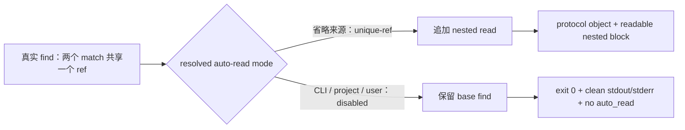
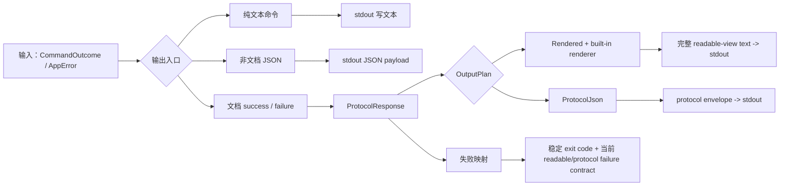
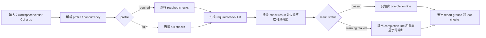
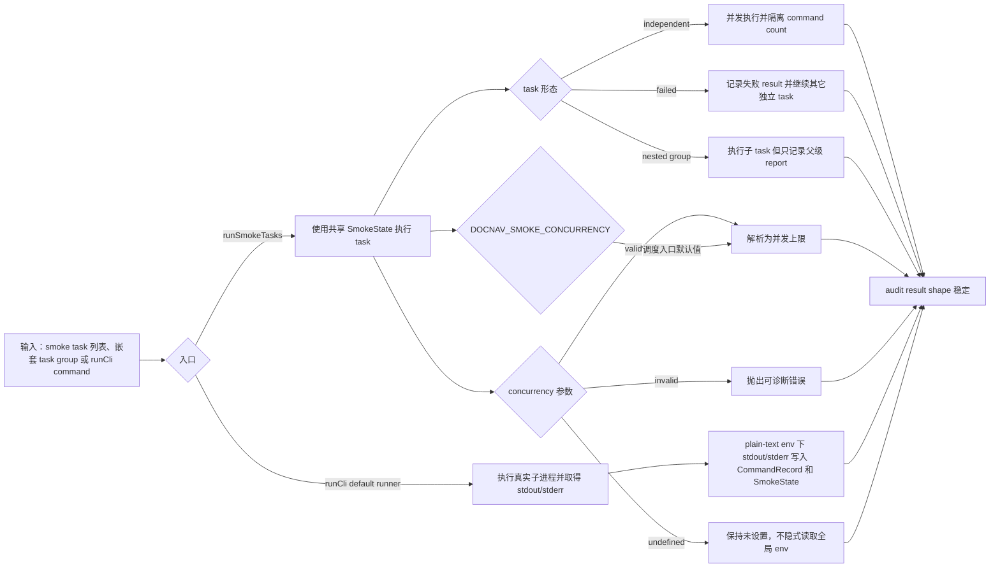
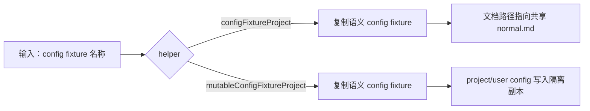
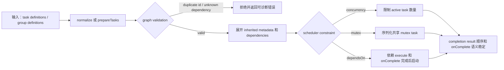
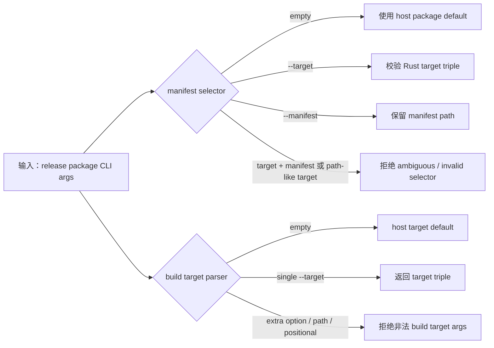
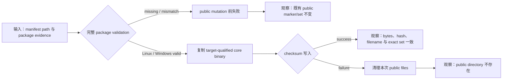
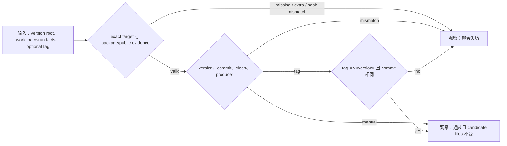
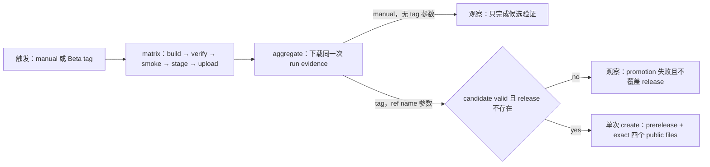

# 测试用例编号账本

本账本索引稳定语义 case 及其主要验证入口，不枚举 supporting unit tests、fixture helpers 或仅用于重构信心的测试函数。归属和 Manual CR 规则见 [测试用例维护](case-maintenance.md)。

## Black-box Cases

### BB-CORE-LINK-001 Core 原样传递真实 Markdown ref
Status: implemented
Existing smoke task: `CORE-LINK-001`
Code: `test/smoke/core/cases/real-markdown.ts`

Proves:
- 真实 `docnav` 进程可以通过 Markdown adapter 完成 `outline -> ref -> read`、`find -> ref -> read` 和 `info` 链路。
- outline/find 返回的 adapter ref 可原样提交给 read，`readable-view` read 保留该 ref；用户可见阅读文本不包含 protocol envelope。

决策说明:
- 保留为一个 smoke case 是因为 `outline`/`find` 产生的 refs、后续 `read` 和 `info` 都复用同一个真实 Markdown project、adapter selection 和 `readable-view` 入口；拆分会重复 fixture 初始化和 ref 获取模板，而不会增加新的 owner 证明。

### BB-CORE-MD-OPTIONS-001 Markdown max_heading_level option 通过真实 CLI 生效
Status: implemented
Existing smoke task: `CORE-LINK-001`
Code: `test/smoke/core/cases/real-markdown.ts`

Proves:
- Markdown `max_heading_level` 可以从 CLI flag 影响 `outline` 可见粒度；越界值作为 adapter-owned option validation error 投影。Project config source 的同类型证明由 `BB-CORE-CONFIG-004` 承担。

### BB-CORE-MD-DOCHEAD-001 Markdown document head 通过真实 CLI 输出模式可观察
Status: implemented
Existing smoke task: `CORE-LINK-001`
Code: `test/smoke/core/cases/real-markdown-document-head.ts`

Proves:
- 真实 CLI fixture 包含 YAML frontmatter、普通前导正文和可见 heading 时，structured outline 在 heading entries 前暴露 `HEAD:leading`。
- `protocol-json` 验证 raw document head entry facts：非空 `label`、`kind = document_head`、`location.line_start`、`metadata.document_region = leading` 和缺少 readable-only `display`。
- `readable-view` 验证 display、成本摘要和 read content block 由内置 renderer 从同一 `ProtocolResponse` 的 raw facts 与 read result 派生。
- 通过 `HEAD:leading` 执行 read 返回 document head 原文，`content_type` 为 `text/markdown`，并保留 frontmatter delimiter 与普通前导正文。

### BB-CORE-REF-001 Adapter ref 错误穿过 Core
Status: implemented
Existing smoke task: `CORE-REF-001`
Code: `test/smoke/core/cases/real-markdown.ts`

Proves:
- 被选中 adapter 拒绝的 ref 会从 core 返回稳定 protocol failure。
- `protocol-json` 承载错误时，stderr 不输出 JSON payload。

### BB-CORE-OUTPUT-001 Core 文档输出模式不混层
Status: implemented
Existing smoke task: `CORE-OUTPUT-001`
Code: `test/smoke/core/cases/outputs.ts`

Proves:
- 省略 output 和显式 `readable-view` 产生相同的 built-in readable-view text contract；`protocol-json` 对同一文档结果输出完整 protocol envelope。
- Readable text 与 protocol JSON 保持隔离：presentation-only display/cost/framing 不进入 protocol raw result，success/failure 仍分别保留当前 owner 的可观察语义。
- CLI 显式选择或 project config 选择 `protocol-json` 时，navigation response 产生前的 document failure 仍输出完整 failure envelope，不回退到 `readable-view`；project-selected 分支同时覆盖低优先级 user config 加载失败。
- CLI 或 config 使用已删除的 `readable-json` 时走普通 invalid-value boundary，不产生 alias、fallback 或 document output。
- Unstructured outline selected by config 在 `readable-view` 中作为 content block、在 `protocol-json` 中作为 raw result 可观察，并且不虚构 entries/ref/page/continuation。

### BB-CORE-AUTO-READ-001 Core unique-ref auto-read 默认值与关闭来源可观察
Status: implemented
Existing smoke task: `CORE-AUTO-READ-001`
Code: `test/smoke/core/cases/auto-read.ts`

Proves:
- 真实 `find` CLI 在所有 auto-read 来源省略且当前返回结果只有一个 distinct ref 时，默认以 `unique-ref` 追加 nested read；`protocol-json` 与 `readable-view` 从同一结果保留 ref、content type 和 nested content。
- CLI、默认 project config fixture 或显式 user config fixture 解析为 `disabled` 时，真实进程以退出码 `0` 返回原 base find，stdout 保持所选输出模式且 stderr 为空；代表性 protocol/readable 分支均不出现 `auto_read`，readable base projection 也不产生 block。

### BB-CORE-ARGS-001 Core 拒绝缺失的 operation 参数
Status: implemented
Existing smoke task: `CORE-ARGS-001`
Code: `test/smoke/core/cases/cli-args.ts`

Proves:
- document command 缺少本 operation 拥有的必需参数时返回稳定 input failure。
- 该 smoke case 代表这一类外部 CLI 错误，不枚举所有 parser 组合。

### BB-CORE-CONFIG-001 Config inspect source status 与参数事实可观察
Status: implemented
Existing smoke task: `CORE-CONFIG-001`（从旧 config editor coverage 更新）
Code: `test/smoke/core/cases/config-management.ts`

Proves:
- `docnav config inspect` reports selected project/user source scope、origin、load state、source diagnostics and current adapter/output/pagination parameter facts without modifying either selected file。
- Inspect output includes the config-source projection entry for the observed pagination field.
- Disabled pagination configured through direct config file edit remains observable through inspect facts；an `outline` command with an explicit numeric `--limit` returns the complete three-entry fixture outline with `page: null`.

### BB-CORE-CONFIG-002 Invalid config value 通过 inspect/source validation 被拒绝
Status: implemented
Existing smoke task: `CORE-CONFIG-002`（从旧 config editor coverage 更新）
Code: `test/smoke/core/cases/config-management.ts`

Proves:
- A selected config source containing `defaults.output: "text"` appears in `docnav config inspect` source diagnostics as field `defaults.output` with reason `enum_invalid`.

### BB-CORE-CONFIG-003 Legacy defaults.limit 通过 config source diagnostic 被拒绝
Status: implemented
Existing smoke task: `CORE-CONFIG-003`
Code: `test/smoke/core/cases/config-management.ts`

Proves:
- project config 中的 legacy `defaults.limit` 会在真实 `outline` CLI 链路中返回 config-owned `INVALID_REQUEST`。
- structured `unknown_config_field` / `config_issues` diagnostic 报告字段、source level、path origin 和 config path。

### BB-CORE-CONFIG-004 Adapter-scoped config 按 catalog operation applicability 生效
Status: implemented
Existing smoke task: `CORE-CONFIG-004`（从旧裸 options coverage 更新）
Code: `test/smoke/core/cases/config-management.ts`

Proves:
- Project config 中的 `options.docnav-markdown.max_heading_level` 通过 core-authored Markdown-scoped catalog entry 影响 `outline` entries。
- User config 中的 `options.docnav-markdown.max_heading_level` 通过 direct config file edit/read 参与 source priority；当 catalog 不把该参数绑定到 selected operation 时，返回 structured unsupported diagnostic 并保留 source level/path。

### BB-CORE-CONFIG-PATH-001 Config path flags select CLI config targets
Status: implemented
Existing smoke task: `CORE-CONFIG-PATH-001`（从旧 config editor coverage 更新）
Code: `test/smoke/core/cases/config-management.ts`

Proves:
- 真实 document operation 通过 `--project-config <path>` 和 `--user-config <path>` 使用显式 selected config files，而不是 project context、`DOCNAV_CONFIG_DIR` 或平台默认路径。
- `docnav config inspect --project-config <path> --user-config <path>` reports exactly those selected source paths and their origins without writing either file.
- Document operations and `config inspect` share the same config source descriptor/path selection boundary, while document operation value resolution remains owned by navigation input resolution.
- Representative mutating legacy command `config set` with selected config path flags is rejected through the normal CLI parse/error boundary and does not modify selected files; the removed command names form one parser equivalence class.

### BB-CORE-SELECT-001 显式 adapter 失败返回 selection diagnostic
Status: implemented
Existing smoke task: `CORE-SELECT-001`
Code: `test/smoke/core/cases/adapter-selection.ts`

Proves:
- 显式 CLI 或 project config 选择的 adapter 不存在时返回 adapter selection diagnostic，不隐藏为 registry fallback。
- 显式 adapter id 不存在时，即使同一请求携带 invalid-looking native option，也返回 adapter selection diagnostic，而不是 option validation error。

### BB-CORE-FAIL-001 Candidate probe failure 投影为格式候选摘要
Status: implemented
Existing smoke task: `CORE-FAIL-001`
Code: `test/smoke/core/cases/failures.ts`

Proves:
- candidate discovery 阶段的 built-in adapter probe failure 被报告为 `FORMAT_UNKNOWN` candidate summary。
- candidate failure 不会被折叠成 selected adapter layer failure。
- 未显式声明 adapter 的 automatic discovery 全部 probe 失败时，candidate failures 从属于 primary diagnostic details。

### BB-CORE-SOURCE-001 Core adapter source 来自 static registry
Status: implemented
Existing smoke task: `CORE-SOURCE-001`
Code: `test/smoke/core/cases/failures.ts`

Proves:
- core release 内置 adapter dispatch 使用 static registry 中的 linked adapter implementation。
- 默认 document operation 的 implementation source 与项目配置中的普通文件内容解耦。

### BB-CORE-TOOLS-001 Core 非 document 命令保持可用
Status: implemented
Existing smoke task: `CORE-TOOLS-001`
Code: `test/smoke/core/cases/config-management.ts`

Proves:
- `init` 通过真实 CLI 创建 project config。
- `version` 输出 crate version，document help 暴露 output/pagination CLI options。

### BB-CORE-ADAPTER-MGMT-001 Core adapter inspection 命令覆盖
Status: implemented
Existing smoke task: `CORE-ADAPTER-MGMT-001`
Code: `test/smoke/core/cases/config-management.ts`

Proves:
- `doctor` 报告 static registry 和 adapter layer checks。
- `adapter list` 输出 core release static registry 内置 Markdown adapter metadata。

### BB-RELEASE-PACKAGE-001 发布包二进制 smoke
Status: implemented
Code: `scripts/release-package/smoke.ts`

Proves:
- release package 内二进制可执行，manifest、文件集合、校验和和 host/target 选择保持一致。
- package smoke 与 release script 参数解析分层。

## White-box Cases

### WB-CORE-OUTPUT-001 Core 输出编排保持通道边界
Status: implemented
Code: `crates/docnav/src/output/tests.rs`

Proves:
- Core 把 document success 和提前发生的 document failure 统一表示为 `ProtocolResponse` 后再执行 output plan。
- 省略 output 或显式 `readable-view` 构造携带内置 renderer 的 `Rendered`；`protocol-json` 构造 `ProtocolJson`，non-document output 保持 owner-specific。
- 内置 renderer failure 沿用现有 output failure/exit mapping：stdout 为空、stderr 诊断有界，不切换 plan 或 renderer。
- Core document output composition 保持 stdout、stderr 和 exit code 职责，并覆盖真实 CLI smoke 中观察到的两个 public document output modes。

决策说明:
- 保留为一个多分支 case 是因为所有断言都进入同一个 core output composition 边界，并共享 document response、stdout/stderr 和 exit-code fixture；拆分会重复相同的 core mapping 基底。

### WB-CORE-HELP-001 Core parser help/version 不进入 document output mode
Status: implemented
Code: `crates/docnav/src/cli/parser/tests.rs`

Proves:
- `--help` 和 operation help 返回 typed help command，并且 document output 只展示 `readable-view` 与 `protocol-json`。
- Operation help 按 core catalog binding 展示当前 operation 可用的参数；例如 outline 展示 `--max-heading-level`，read 不展示。
- root help、version、config、adapter、init 和 doctor 保持各自的 static surface，不进入 document output mode。

### WB-CORE-OUTPUTMODE-001 Core parser document output mode 解析稳定
Status: implemented
Code: `crates/docnav/src/cli/parser/tests.rs`

Proves:
- 未显式传入 `--output` 时 parser 不抢先解析默认值，由 document request/config chain 决定。
- `readable-view` 与 `protocol-json` 可解析；已删除的 `readable-json` 与其它合法值集合之外的 output value 返回普通可诊断 invalid-value error。

### WB-CORE-ARGS-001 Core parser 保持 operation 参数所有权
Status: implemented
Code: `crates/docnav/src/cli/parser/tests/document_arguments.rs`

Proves:
- generated operation-owned 参数保留 canonical identity、CLI locator 与 normalized typed/invalid candidate，selected validation 继续负责 field-local 约束。
- generated valueless Boolean switch 与 value flags 都从 current static/generated Clap shape 派生 lexical facts，并由 Clap 捕获 normalized candidate。
- Clap 拥有 unknown、missing value 和 duplicate single-value structural failures；lexical compatibility boundary 只使用同源 cardinality facts 保持 positional 与 operation-inapplicable diagnostics。
- 未被当前 operation 使用的 known argument 不会被抢先 typed 解析，而是在 parser 边界返回 input diagnostic。

### WB-CORE-ARGS-REPAIR-001 Core parser input diagnostics expose protocol repair context
Status: implemented
Code: `crates/docnav/src/cli/parser/tests/document_arguments.rs`

Proves:
- Unknown document flags、extra document positionals and operation-inapplicable known arguments produce parser diagnostics whose protocol-json error projection preserves reason、received token、expected context and repair guidance.

### WB-CORE-CONFIG-PATH-001 Core parser accepts config file path flags
Status: implemented
Code: `crates/docnav/src/cli/parser/tests/config_paths.rs`

Proves:
- Core parser accepts `--project-config <path>` and `--user-config <path>` on document operations, `config`, and `doctor`; accepts `--project-config <path>` on `init`; and rejects missing values or use on undocumented commands before reading config sources or dispatching operations.
- Parsed document/config/doctor commands preserve both selected path flag values, while init preserves the supported project path value only.

### WB-CORE-CONFIG-SOURCE-001 Core config source validation preserves navigation-owned fields
Status: implemented
Code: `crates/docnav/src/config/store/tests.rs`

Proves:
- Core config source loading accepts documented navigation-owned `outline.mode_rules[]` and `outline.auto_full_read.thresholds[]` fields instead of rejecting them as unknown top-level config.
- Core config source validation preserves raw `outline` config for inspection/read purposes while validating core-authored defaults and adapter-scoped catalog config keys.
- Bare `options.max_heading_level` is rejected as an ordinary `unknown_config_field`; it is not migrated or interpreted as an adapter-id native option source path.
- Invalid adapter-id native option values and nested non-object fields produce structured source-attributed config issues.
- Default missing config paths remain absent, while explicit missing paths report `missing_explicit_cli` with explicit path origin.

### WB-CORE-CONFIG-PATH-002 Core config inspect uses selected config file paths
Status: implemented
Code: `crates/docnav/src/config/commands/tests.rs`

Proves:
- Complete serialized-output goldens cover one valid selected project/user pair and one invalid-JSON project source. They lock source status、summaries、registry-backed config-source projection、resolved parameter facts、source-attributed diagnostics and top-level output shape while normalizing only runtime paths.
- The valid golden proves adapter-id native option projection and project/user/built-in provenance without modifying either selected file. The invalid-load golden proves invalid JSON remains a successful inspection result with matching source and parameter diagnostics.
- Explicit missing、top-level non-object and not-file source states retain focused equivalence checks；unreadable source loading remains owned by lower-layer config loading / parameter-resolution tests. Optional non-JSON config `null` suppresses its static default without creating a parameter fact.
- `init --project-config` creates or preserves the selected project config file and rejects an existing directory at that selected file path.

### WB-CORE-INVOCATION-LOG-001 Core runtime invocation log 保持审计边界
Status: implemented
Code: `crates/docnav/src/runtime/tests/invocation_logging.rs`

Proves:
- Invocation logging 默认关闭，且配置关闭时不创建日志副作用。
- CLI/config 显式启用后，core document operation 写入 JSONL operation event，并保留 request id、adapter id、operation status、bounded failure layer/code/summary 和 stdout purity。
- Config load failure 可由显式 CLI log 在 runtime config 初始化前记录为 config-layer failure。
- Metadata-only read event 只记录 SHA-256 content hash、content type 和 size metadata；未单独开启 content capture 时不写正文文件。
- 单独开启 content capture 后正文文件只写入独立 root 下的日期/`sha256-<content_hash>.content` 相对路径，文件 bytes hash 与主日志 hash 一致。
- Successful outline/find auto-read 仍只记录根 operation event；追加的 read content 复用既有 metadata-only content reference，显式 capture 时复用同一个 hash/capture event shape，未显式 capture 时不写正文文件。
- Unique-ref 已触发但 nested read 返回 adapter diagnostic 时，public/base command 仍成功；日志只保留单个 root `operation_completed`，不记录 nested diagnostic 或正文，也不产生 read root event 或 content capture。
- 日志文件写入失败、output projection failure 和 content capture failure 不改变原 document operation 的成功/失败语义。

决策说明:
- 保留为一个多分支 case 是因为所有断言共享 core runtime document operation、output projection 和 invocation log writer 链路；拆分会重复 project/config/log fixture 初始化，且不会改变 owner 边界。

### WB-NAV-INPUT-RESOLUTION-001 Navigation input resolution 保持来源解析边界
Status: implemented
Code: `crates/shared/navigation/src/tests/navigation/native_options.rs`

Proves:
- Navigation input resolution preserves source labels for explicit input and project config option issues.
- Navigation receives normalized CLI candidates with canonical identity/locator/source facts；selected catalog members enter canonical resolution, while a parameter absent from the core catalog fails before request construction and dispatch.
- The core-authored catalog controls adapter scope、operation applicability、typed validation and static defaults；navigation resolves selected fields without reconstructing those facts.
- Config source projection uses `options.<adapter-id>.<option-key>`; equal option keys in different adapter id namespaces stay distinct, and bare `options.<option-key>` is a normal unknown/invalid config path.
- Navigation consumes adapter-scoped values only from the selected adapter namespace for the selected operation; other known adapter namespaces are not forwarded to the selected strategy.
- Static catalog defaults affect the resolved operation result when no explicit/project value is provided.
- Protocol `OperationArguments` and closed `StandardOperationInput` are sibling projections of the same resolved values；optional config `null` suppresses both default projections.
- Unknown adapter namespaces、unknown selected options、operation-inapplicable options and invalid typed values remain blocking source-attributed diagnostics.

### WB-NAV-OUTLINE-MODE-001 Navigation outline_mode selectors and pre-dispatch stable
Status: implemented
Code: `crates/shared/navigation/src/tests/navigation/outline_mode.rs`

Proves:
- path rules use deterministic source/order priority, can select unstructured full read, and can opt out to structured before cost thresholds run.
- adapter-scoped cost thresholds filter by selected adapter, merge same-unit thresholds to the minimum value, request only declared units, and fall back to structured when measurement is missing or unavailable.
- outline config source shape rejects an unregistered `outline.*` key, an unregistered `outline.mode_rules[]` item key, missing required members and invalid typed values before selector parsing and reports the source-scoped nested field path.
- Current owner-specific outline validation preserves parity across config inspect source validation, direct config read and navigation resolution; typed-fields compound helper tests are only added if this parity cannot be proven.
- unstructured full-read pre-dispatch skips the normal outline handler and returns either default UTF-8 content, adapter hook content with selector cost, or adapter hook result facts with stable `path_rule` / `cost_threshold` reasons.
- path-triggered default full-read returns a controlled non-UTF-8 failure instead of producing lossy content.

### WB-CORE-PREFLIGHT-001 Core preflight 检测 protocol-json intent
Status: implemented
Code: `crates/docnav/src/cli/preflight/tests.rs`

Proves:
- Core preflight 从 current document command 的 canonical projection 获取 output locator/cardinality，并在解析失败前识别空格分隔和等号形式的 protocol-json intent。
- Structural document failure 使用 projected output intent 选择 protocol failure framing。
- Root 与 non-document commands 不触发 document projection；preflight 只服务错误输出模式选择，不替代正式 parser。

### WB-CORE-ADAPTER-001 Core 校验 adapter contract 对齐
Status: implemented
Code: `crates/docnav/src/registry/tests.rs`

Proves:
- Core static registry 包含 release 内置 Markdown adapter descriptor metadata。
- Adapter layer check 从 adapter definition 读取 metadata，并把 core-owned implementation source 保留为 static registry fact。
- `adapter list` preserves the same static-registry id and implementation-source projection.

### WB-CORE-DOCTOR-001 Doctor 聚合 typed check 退出码
Status: implemented
Code: `crates/docnav/src/config/doctor.rs`

Proves:
- selected config file 失败使用其 typed input error 退出码。
- adapter layer failure 使用 adapter/protocol 退出码，并在多个失败同时存在时按严重度决定 doctor 退出码。

### WB-CORE-ADAPTER-SURFACE-001 Core adapter command surface 保持静态注册表边界
Status: implemented
Code: `crates/docnav/src/cli/parser/tests.rs`

Proves:
- `adapter list` 解析为 static registry inspection command。
- 默认 adapter command surface 只接受 `adapter list` 作为 inspection command。

### WB-NAV-ADAPTER-SOURCE-001 Navigation adapter selection 保持静态来源边界
Status: implemented
Code: `crates/shared/navigation/src/tests/navigation/adapter_source.rs`

Proves:
- 显式声明的 adapter id 不存在于 static registry 时返回 `ADAPTER_UNAVAILABLE`。
- diagnostic owner 来自 `docnav-navigation` routing，而不是 core routing。
- guidance 指向 current core release static registry。
- Automatic discovery 全部候选失败时返回 `FORMAT_UNKNOWN`，并把 routing-owned probe failure reason 投影到 primary details 的 `candidate_failures`。
- 本 case 不证明 discovery 顺序、extension metadata 排序或 manifest metadata 与 candidate failure 的关系。

### WB-DIAG-RULES-001 Diagnostics code rules 保持稳定
Status: implemented
Code: `crates/shared/diagnostics/src/tests/code_rules.rs`

Proves:
- `DiagnosticCode::all()` exposes the current diagnostic registry, including representative protocol and boundary diagnostic codes.
- Each registry code exposes a non-empty unique stable string、non-empty details rule 和可用的 diagnostic projection route。

### WB-DIAG-RECORD-001 Diagnostic record construction validates typed details
Status: implemented
Code: `crates/shared/diagnostics/src/tests/record.rs`

Proves:
- `DiagnosticRecordDraft::into_record()` creates primary records with code defaults, typed details, source and absent guidance preserved.
- Record construction rejects empty summaries and erased details whose shape does not match the diagnostic code.
- Format diagnostic details can carry subordinate `candidate_failures` in the primary record details object.

### WB-CLIARGS-BOUNDARY-001 Strict CLI 参数扫描保持输入边界
Status: implemented
Code: `crates/shared/cli-args/src/tests.rs`

Proves:
- unknown flag 不消费后续 positional，used value flag 保留值，unused value flag 记录 operation applicability failure。
- switch flag、missing value、extra positional 和 unknown token 边界保持可观察，并可映射为 input diagnostic。

### WB-JSONIO-WRITE-001 JSON writer 保持格式和错误分类
Status: implemented
Code: `crates/shared/json-io/src/tests.rs`

Proves:
- compact/pretty JSON 都以换行结束。
- serialization failure 和 writer failure 保持不同错误类型。

### WB-OUTPUT-DOCUMENT-001 共享 document output facade 分层
Status: implemented
Code: `crates/shared/output/src/tests.rs`

Proves:
- `ProtocolJson` 与 `Rendered(RenderStrategy)` 共同消费 success/failure `ProtocolResponse`；protocol path 不调用 renderer，rendered path 只调用 plan 携带的 renderer。
- Custom renderer 成功时 stdout 精确等于其返回的完整 UTF-8 text，不由 output facade 追加 framing 或换行。
- `RenderFailure` 发生在第一次 stdout write 前，保持 stdout 为空且不调用 fallback renderer；渲染成功后的 writer failure 保持独立 I/O failure。

决策说明:
- 保留为一个 facade case 是因为 success/failure response、两个 output plans、custom renderer invocation 和 writer boundary 都复用 `docnav-output` document facade；这里证明输出编排，不重新证明内置 mapping、protocol 字段、navigation selector 或 adapter behavior。

### WB-TEXT-COST-001 Shared text cost helper 保持纯文本边界
Status: implemented
Code: `crates/shared/text-cost/src/tests.rs`

Proves:
- shared text cost helper functions 只接收纯文本并返回 unscoped protocol-compatible `Measurement`。
- `line_cost`、`byte_cost` 和 `token_cost` 分别固定 `lines`、`bytes`、`tokens` unit，并覆盖空文本、Unicode bytes、换行和 plain-text `o200k_base` token counting。

### WB-READABLE-RENDERER-001 内置 readable renderer private block/framing 规则
Status: implemented
Code: `crates/shared/readable/src/renderer/tests/success.rs`

Proves:
- 内置 renderer 的 private presentation helper 保持 readable-view header、block replacement、UTF-8 byte length、LF framing、extension fields 和 operation-specific block/no-block config。
- Conformance representatives 保持 successful auto-read 的 `/auto_read/read/content` nested block、无 `auto_read` 的 structured outline header-only projection，以及 unstructured outline 的 `/content` base block。
- Private readable error value 和 header standalone JSON 可还原为最终 readable-view text；该 helper value 不形成 public output mode 或 schema。

决策说明:
- 保留 block/framing 成功矩阵为一个 case 是因为这些断言共享 renderer config、private presentation fixture 和可还原 readable-view 文本基底；拆分成按 operation 的 case 会重复 header/block parsing 模板。
- Private value conversion 当前证明目标限定为有效 typed presentation -> internal value。Serialization failure 需要人工构造 failing `Serialize` 才能触发，不登记为独立证明目标；若 production helper 引入非平凡序列化失败风险，再新增窄单测覆盖该分支。

### WB-READABLE-RENDERER-002 内置 readable renderer private config/error 边界稳定
Status: implemented
Code: `crates/shared/readable/src/renderer/tests/errors.rs`

Proves:
- renderer 可以区分 missing pointer、non-string target、duplicate pointer 和 pointer syntax。
- renderer failure 使用稳定 error id `readable_view_render_failed`。

### WB-READABLE-VIEW-001 内置 readable-view 从 ProtocolResponse 派生
Status: implemented
Code: `crates/shared/output/src/tests.rs`

Proves:
- Typed success `ProtocolResponse` representatives 覆盖 structured outline、unstructured outline、read、find 和 info 到 built-in readable-view 的 mapping；failure response 覆盖 readable failure presentation。
- Structured outline/find 的 `display`、read 的成本摘要、info summary、unstructured raw facts 和 failure fields 都从 response 语义派生。
- Block assertions 按 JSON `Value` 比较 header 语义，并精确验证 LF separator、block start marker、UTF-8 byte length、payload、end marker 和唯一尾部 LF；header member order 不属于断言。

决策说明:
- 这些 operation representatives 共享 `docnav-output` 拥有的 `ProtocolResponse` 到 built-in `RenderStrategy` mapping；低层 private readable `Value`、config 和 framing conformance 继续由 `WB-READABLE-RENDERER-001` 承接，不在本 case 复制 fixture matrix。

### WB-PROTO-BASIC-001 Protocol 基础类型和 envelope 规则稳定
Status: implemented
Code: `crates/shared/protocol/src/tests/basic.rs`

Proves:
- positive integer、non-empty generated request id、success response 和 failure operation preservation 保持协议基础不变量。
- outline success response coverage includes structured and unstructured discriminator branches, including the unstructured no entries/ref/page/continuation boundary.

### WB-PROTO-DIAGNOSTICS-001 Protocol diagnostic mapping and projection 保持稳定
Status: implemented
Code: `crates/shared/protocol/src/tests/basic.rs`

Proves:
- request、document、adapter-boundary 和 internal category 各有一个 protocol diagnostic code 代表，其 diagnostic projection rule 暴露对应 protocol code。
- Navigation routing protocol errors expose static-registry guidance, and protocol errors round-trip through `DiagnosticRecord` projection while preserving guidance.
- Invalid-request records with config issue details project protocol owner, location and received value from the diagnostic record.

### WB-PROTO-DECODE-001 Protocol decode wrapper 返回可达阶段结果
Status: implemented
Code: `crates/shared/protocol/src/tests/decode.rs`

Proves:
- Protocol request decoding runs schema/field-contract validation before raw typed decode.
- Protocol request decoding rejects unmapped request arguments at the schema stage.
- Protocol request decoding preserves defaultable empty arguments for operation-specific later resolution.
- Manifest wrapper returns the current typed manifest shape.
- Probe result semantic validation and protocol response operation/result pairing remain semantic-stage failures.

### WB-PROTO-SCHEMA-001 Protocol fixtures 和 schema constraints 被实现测试消费
Status: implemented
Code: `crates/shared/protocol/src/tests/schema.rs`

Proves:
- 作为两条 output paths 统一输入的 success/failure `ProtocolResponse` fixtures 通过既有 public JSON Schema、runtime typed contract validation，并 deserialize 为共享 protocol types。
- protocol request、protocol response、manifest 和 probe 的 unknown fields、missing required fields、wrong types、version constants、field constraints 和 semantic boundary 被实现测试消费。

### WB-TYPED-FIELDS-001 Typed field definition core 保持字段级不变量
Status: implemented
Code: `crates/shared/typed-fields/src/tests/field_model.rs`

Proves:
- Builder 生成 field identity、processing strategy-backed structured path、`FieldValidation<T>`、typed default metadata 和 schema metadata view，并能把合法 JSON value 校验为 typed value。
- Field metadata validation 区分 missing optional、wrong type 和 range violation，并保留 field identity、field path 和 machine-readable reason。
- Required enum field declaration 使用 Rust enum metadata 校验 allowed value，missing required 和 disallowed enum value 返回可诊断 validation failure。

### WB-TYPED-FIELDS-PROCESSING-001 Typed field processing build 稳定
Status: implemented
Code: `crates/shared/typed-fields/src/tests/processing.rs`

Proves:
- Processing build 接受 processing id 和 caller-provided function，可以用 typed raw input 返回 caller processing result；typed-fields 不解释处理函数内部语义。
- Empty processing id 在 build 阶段失败。
- Field set build rejects a leaf declaration without a processing strategy and preserves the declaration path in the build error.

### WB-PARAM-FIELD-CONTRACT-001 Canonical FieldDefSet preserves parameter declaration invariants
Status: implemented
Code: `crates/shared/typed-fields/tests/canonical_parameters.rs`

Proves:
- One `FieldDefSet` exposes declared CLI flag、environment variable and config path locators from canonical processing metadata；optional CLI help、value name and Boolean encoding survive builder clone、declaration type erasure and aggregation beside canonical field facts.
- Definition-set build rejects duplicate processing locators、empty locator values、invalid dotted identities、invalid/duplicate CLI metadata attachments and incompatible、incomplete or ambiguous Boolean encodings with public errors；config-only fields remain valid without CLI metadata.
- `MergeStrategy` is canonical `FieldDef` metadata, defaults to `Replace`, and rejects strategies incompatible with the declared value kind.
- Canonical field lookup performs final value validation and returns a typed value or a stable wrong-type failure.

### WB-PARAM-SOURCE-EXTRACTION-001 Resolution core preserves normalized source facts
Status: implemented
Code: `crates/shared/cli-config-resolution/tests/canonical_core.rs`

Proves:
- Environment extraction queries only declared `EnvVar` locators；unknown environment entries are ignored and missing declared variables produce no candidate.
- Decodable values become normalized candidates；decode failures retain raw input、reason、source id and environment locator and block when selected or merge-contributing.
- `Source` exposes source kind、priority and candidate locator facts. CLI and structured-config extraction are proven by their companion cases.

### WB-PARAM-RESOLVE-001 Canonical resolution preserves one ordered merge chain
Status: implemented
Code: `crates/shared/cli-config-resolution/tests/canonical_core.rs`

Proves:
- Higher priority wins；at equal priority, the later registered source wins deterministically. Static defaults automatically fall back, while an explicit dynamic-default source remains an ordinary source fact.
- `Replace`、`Append`、`MapMerge` and `DenyConflict` apply in deterministic low-to-high source order；append/map contributors and all deny-conflict locators remain observable in provenance/diagnostics.
- Canonical constraints are applied to the final merged value. Selected or merge-contributing invalid candidates block materialization, while an overridden invalid replacement remains trace-only.
- Missing required values and final validation failures return diagnostics and prevent partial `FieldValueMap` materialization.

### WB-PARAM-SERDE-001 serde config-path mapping preserves candidate facts
Status: implemented
Code: `crates/shared/cli-config-resolution-serde/src/lib.rs`

Proves:
- Only `ConfigPath` metadata declared by the canonical `FieldDefSet` is queried；extra config entries and missing paths produce no candidate.
- Present `null`、`false`、empty array and empty object values each remain present candidates with their JSON structure and config-path locator intact.
- A non-object intermediate behaves as an absent declared path；using a non-config processing locator returns a public `ConfigExtractionError` instead of panicking.

### WB-CONTRACTS-ERROR-001 Adapter contracts error mapping 保持 protocol 投影边界
Status: implemented
Code: `crates/shared/adapter-contracts/src/tests.rs`

Proves:
- Adapter document errors project to protocol error code, owner, location and default guidance through `AdapterError::protocol_error()`.
- Adapter-owned native option errors project issue metadata to invalid-request received, expected, details and guidance fields.

### WB-CONTRACTS-DEFINITION-001 Adapter definition validation 收敛 full-read capability facts
Status: implemented
Code: `crates/shared/adapter-contracts/src/tests.rs`

Proves:
- Adapter definition validation rejects a declared but empty unstructured full-read capability set.
- Adapter definition validation rejects blank or duplicate cost measurement units.

### WB-CONTRACTS-UNSTRUCTURED-001 Adapter contracts unstructured full-read hook defaults 稳定
Status: implemented
Code: `crates/shared/adapter-contracts/src/tests.rs`

Proves:
- Adapter contract default unstructured full-read capabilities are absent unless the adapter opts in.
- Default unstructured full-read content hook returns an adapter error, cost measurement returns an empty `Cost`, and result facts return defaults.

### WB-NAVIGATION-DISPATCH-001 Navigation config source loading and dispatch 稳定
Status: implemented
Code: `crates/shared/navigation/src/tests/navigation/config_sources.rs`

Proves:
- `docnav-navigation` 接收 config source descriptor paths 并由 navigation boundary 加载 project/user raw config sources。
- Project config source values under `options.<selected-adapter-id>.<option-key>` participate in selected catalog resolution and closed-input dispatch, producing the expected protocol success result.
- Values under other known adapter id namespaces remain separate source facts and are not forwarded to the selected strategy.
- Nested non-object config source shapes at `defaults`、`defaults.pagination` and `options` return navigation-owned typed input errors.

### WB-NAVIGATION-CONFIG-SOURCES-002 Navigation loads config sources with descriptor origin
Status: implemented
Code: `crates/shared/navigation/src/tests/navigation/config_sources.rs`

Proves:
- `docnav-navigation` loads project/user config sources from core-supplied descriptors that carry source level, resolved path and path origin.
- Default-path missing project/user config sources are absent without diagnostics.
- Explicit-path missing、unreadable、invalid JSON 和 top-level non-object config sources return blocking config source diagnostics with source level and selected config file path.
- Selecting a config file through CLI flag does not promote values inside that file to direct argv source; parameter priority remains `explicit > project > user > built_in`.

### WB-NAVIGATION-HARD-CUTOVER-001 Core catalog cutover preserves resolver parity
Status: implemented
Code: `crates/shared/navigation/src/tests/navigation/hard_cutover.rs`

Proves:
- Normalized explicit `Source` carries core-catalog common and adapter-scoped candidates into navigation；explicit values retain priority over project and user values through the canonical resolver, and the public output mode/result remains unchanged.
- A valid higher-priority explicit common or adapter-scoped value does not hide an invalid project/user config candidate；the blocking diagnostic retains source level、selected config path and reason.
- Mixed invalid common and adapter-scoped catalog inputs retain catalog field order when selecting the primary diagnostic.

### WB-NAVIGATION-FIELD-SETS-001 Selected field set follows closed catalog applicability
Status: implemented
Code: `crates/shared/navigation/src/parameters/fields/tests.rs`

Proves:
- The selected operation field set combines fixed operation inputs with the core-authored parameter catalog projection.
- Adapter-scoped catalog fields are included only for the selected adapter；fields scoped to another adapter are excluded.

### WB-MD-REF-GRAMMAR-001 Markdown ref grammar 稳定
Status: implemented
Code: `crates/adapters/markdown/src/markdown/refs/tests.rs`

Proves:
- canonical heading ref 由 line 和 level 结构字段构成。
- parser 将一个非法字段、一个未知 ref 类型和一个前导零输入代表映射到 grammar 外输入；同类拼写和完整正则约束由 Markdown owner 的 Manual CR 维护。

### WB-MD-REF-MATCH-001 Markdown parsed ref 精确匹配 heading 坐标
Status: implemented
Code: `crates/adapters/markdown/src/markdown/refs/tests.rs`

Proves:
- parsed heading ref 在 line 和 level 同时匹配时命中目标 heading。
- matcher 的命中条件由 parsed ref 的 line 和 level 决定。

### WB-MD-PARSE-001 Markdown parser 忽略非 heading 结构
Status: implemented
Code: `crates/adapters/markdown/src/markdown/tests.rs`

Proves:
- code fence pseudo heading、invalid heading 和 frontmatter 不进入 heading model。
- section boundary 按 Markdown heading 层级截断。

### WB-MD-OUTLINE-001 Markdown outline ref 和 display 语义稳定
Status: implemented
Code: `crates/adapters/markdown/src/markdown/tests.rs`

Proves:
- outline 生成 canonical ref，重复 title/path 不影响 ref，max heading level 只影响可见性。
- deep-only document 在当前可见层级下 fallback 到 `doc:full`。
- outline cost 按 `lines`、`bytes`、`tokens` 顺序报告 entry-scoped measurements，display 保留 title/cost，但 ref 不包含展示文本。

### WB-MD-DOCHEAD-001 Markdown document head outline eligibility 和 raw facts 稳定
Status: implemented
Code: `crates/adapters/markdown/tests/adapter/outline_ref.rs`

Proves:
- document head 定义为文档开头到第一个有效 Markdown heading 起点之前的原文区域，frontmatter 内伪 heading、代码围栏伪 heading 和普通 horizontal rule 不改变第一个有效 heading 判定。
- document head 非空、非纯空白且当前 structured outline 至少有一个可见 heading entry 时，outline 始终在 heading entries 前暴露 `HEAD:leading`。
- 空或纯空白 document head 不暴露 `HEAD:leading`，heading entries 的顺序和 canonical heading ref grammar 保持不变。
- 当前 outline 参数过滤后没有可见 heading entry 时，outline 保留单条 `doc:full` fallback，不只返回 document head entry。
- raw document head entry facts 使用非空 `label`、非 heading `kind`、`location.line_start` 和 `metadata.document_region = leading`；readable-only `display` 不进入 raw protocol contract。

### WB-MD-DOCHEAD-002 Markdown document head read/find roundtrip 和分页稳定
Status: implemented
Code: `crates/adapters/markdown/tests/adapter/paging_find.rs`

Proves:
- `read HEAD:leading` 返回 document head 原文，`content_type` 为 `text/markdown`，并保留 YAML frontmatter 起止 delimiter、注释、空行和普通前导正文。
- document head read 的 `limit` 和 `page` 使用普通 read content 分页规则，按 Unicode 字符预算分页且不拆分字符。
- find 命中 document head 且当前 structured outline 至少有一个可见 heading entry 时返回 `HEAD:leading`，使用该 ref read 可读取包含命中文本的 content。
- find 命中 document head 但当前 outline 使用 `doc:full` fallback 时，返回 ref 仍可 read 到包含命中文本的内容。

### WB-MD-ADAPTER-OUTLINE-001 Markdown adapter outline 默认层级和 fallback 稳定
Status: implemented
Code: `crates/adapters/markdown/tests/adapter/outline_ref.rs`

Proves:
- adapter outline 默认显示 H1-H3，并忽略 code fence 内 heading 和超出默认层级的 heading。
- 没有 visible heading 时 fallback 到 `doc:full`，且 read 能返回完整文档。

### WB-MD-READ-001 Markdown read resolve 和 doc:full ref 稳定
Status: implemented
Code: `crates/adapters/markdown/src/markdown/tests.rs`

Proves:
- canonical ref 可解析到 heading，`doc:full` 可解析完整文档。

### WB-MD-LINK-001 Markdown outline/find ref 可通过 read roundtrip
Status: implemented
Code: `crates/adapters/markdown/src/markdown/tests.rs`

Proves:
- Markdown navigation 生成的 outline entry ref 可以直接传给 read。
- find 生成的 ref 也可直接提交给 read 并成功解析。

### WB-MD-REF-001 Markdown 重复标题生成唯一可读 ref
Status: implemented
Code: `crates/adapters/markdown/tests/adapter/outline_ref.rs`

Proves:
- 位于不同结构坐标的重复 heading 会生成唯一 ref，且每个 ref 都能读取对应 section。

### WB-MD-REF-002 Markdown ref 错误区分 invalid 和 not-found
Status: implemented
Code: `crates/adapters/markdown/tests/adapter/outline_ref.rs`

Proves:
- grammar 外输入返回 `REF_INVALID`。
- 符合 canonical grammar 且当前结构缺少匹配 section 的 ref 返回 `REF_NOT_FOUND`。
- 文档结构变化后的先前 ref 由当前结构重新判定。

### WB-MD-PAGE-001 Markdown read 分页按 Unicode 字符计数
Status: implemented
Code: `crates/adapters/markdown/tests/adapter/paging_find.rs`

Proves:
- Markdown read pagination 按 Unicode 字符计数，不拆分字符。
- page 前进和结束状态可通过返回的 page metadata 观察。
- read cost 使用 selection-scoped helper measurements；token cost 不参与分页预算。

### WB-MD-PAGE-002 Markdown outline/find pagination 保持 continuation
Status: implemented
Code: `crates/adapters/markdown/tests/adapter/paging_find.rs`

Proves:
- outline 和 find 结果按 response page 继续读取直到结束。
- past-end page 返回空结果且不产生 continuation。

### WB-MD-PAGING-DISPLAY-001 Markdown paging helper 保留 ref 并截断 display
Status: implemented
Code: `crates/adapters/markdown/src/paging/tests.rs`

Proves:
- Markdown paging helper 对 Unicode 计数一致。
- display 预算不足时截断 display 而不截断 ref，并在有空间时保留 ellipsis marker。

### WB-MD-FIND-001 Markdown find ref 和 display 语义稳定
Status: implemented
Code: `crates/adapters/markdown/tests/adapter/paging_find.rs`

Proves:
- find 匹配 hidden heading 时，ref 指向当前 visible region 或 full document fallback。
- find display 保留匹配片段且 ref 不受 display 内容影响。
- document head 命中到 `HEAD:leading` 的语义由 `WB-MD-DOCHEAD-002` 覆盖。

### WB-MD-OPTIONS-001 Markdown standard input 控制可见粒度
Status: implemented
Code: `crates/adapters/markdown/tests/adapter/options_error_display.rs`

Proves:
- Closed `OutlineInput` / `FindInput` 中的 `max_heading_level` 同时影响 outline 和 find 的 visible heading granularity。
- Markdown strategy 不为缺失的 `max_heading_level` 重复提供 catalog default。
- Markdown adapter owns the `1..6` semantic range check at its strategy boundary and returns an adapter-option diagnostic for out-of-range standard input.

### WB-MD-META-001 Markdown manifest/probe/info 元数据稳定
Status: implemented
Code: `crates/adapters/markdown/tests/adapter/meta.rs`

Proves:
- manifest 声明 Markdown v0 identity 和 format metadata，probe 返回 format evidence 而不泄漏 navigation payload。
- info 返回 Markdown summary。
- Markdown registry-facing definition exposes manifest identity、linked strategy and the declared full-read capability set.

### WB-MD-ERROR-001 Markdown adapter document error 稳定
Status: implemented
Code: `crates/adapters/markdown/tests/adapter/options_error_display.rs`

Proves:
- non-UTF-8 document 返回稳定 encoding error。

### WB-MD-DISPLAY-001 Markdown outline/find display 保留可读文本
Status: implemented
Code: `crates/adapters/markdown/tests/adapter/options_error_display.rs`

Proves:
- outline display 包含 heading title，find display 包含 match snippet。
- display 不进入 ref，不影响 adapter-owned ref 语义。

## Auxiliary Script Cases

### AUX-WORKSPACE-VERIFY-001 Workspace verifier 保持 required/full profile 语义
Status: implemented
Code: `scripts/docnav-workspace/verify.test.ts`

Proves:
- required 和 full verifier profile 保持区分。
- profile membership 和 report counting 由 verifier tests 明确证明。
- required profile 显式包含 case catalog docs validator 和 validator script tests。
- required profile 包含 quick quality check；full profile 使用 full quality check 替代 quick quality check，并追加更宽验证。
- full profile 的 quality check 使用 verifier 输出；只有未带 `acceptedReason` 的 quality warning 会映射为 verifier warning。
- completion line 和 summary 可区分 passed、warning 和 failed。
- completion duration 在秒数进位时输出规范化的分钟与秒，不产生 `60s` 余数。
- 输出过滤规则由 verifier 配置维护；passed 只输出 completion line，warning 和 failed 保留允许显示的可行动诊断，完整子命令输出写入 verifier log。
- check definition normalization 要求 leaf 提供非空 command，并拒绝同时提供 command 和 tasks 的 group。

### AUX-SMOKE-HARNESS-001 Smoke harness 正确记录 task 和 command 输出语义
Status: implemented
Code: `test/tools/smoke-harness.test.ts`

Proves:
- independent smoke tasks 可以并发运行，同时 command count 按 report 隔离。
- failed task、nested task group、默认 runner 的 stdout/stderr command record、plain-text child environment 和 concurrency validation 保持预期 audit result shape。
- `DOCNAV_SMOKE_CONCURRENCY` 只在 smoke scheduling boundary 作为默认并发输入生效；直接解析 `undefined` 不得隐式读取全局环境变量。
- core smoke 在 caller-owned base 下创建唯一 run child；失败 task 执行时 project cwd 已存在，结束后只删除 owned child 并保留 caller-owned base。

### AUX-SMOKE-HARNESS-002 Core smoke config fixture helper 保持配置/文档分层
Status: implemented
Code: `test/smoke/core/fixtures/project.test.ts`

Proves:
- config cases 使用按语义命名的 checked-in JSON fixture，并复用共享 Markdown document path。
- mutable config cases 把 config fixture 安装到 `.tmp/docnav/smoke/` 的 CLI project wrapper，写入副本不改变 checked-in fixture。

### AUX-PARALLEL-RUNNER-001 Parallel task runner 保持调度契约
Status: implemented
Code: `scripts/tools/parallel-task-runner/test/index.test.ts`

Proves:
- task normalization、concurrency、mutex serialization、dependency completion ordering 和 nested task expansion 保持稳定。
- resolved result 对 scheduler 保持 opaque；consumer status field 不阻塞 dependent，且 dependent 在 `onComplete` 完成后启动。
- prepare strategy、invalid list metadata、duplicate id 和 unknown dependency failure 保持可诊断。

决策说明:
- 保留为一个 runner case 是因为 normalize、prepare、graph validation 和 scheduler constraints 形成同一 task graph pipeline；各分支共享 `NormalizedTask` shape 和 event-order harness。

### AUX-WORKSPACE-PROCESS-001 Shared process wrapper plain-text environment 稳定
Status: implemented
Code: `scripts/tools/foundation/test/foundation.test.ts`

Proves:
- shared process wrapper 在 sync 和 async child process 入口覆盖 caller-provided color env，统一注入 plain-text output environment。

### AUX-QUALITY-PARSER-001 Quality scanner parser fixtures 稳定
Status: implemented
Code: `scripts/tools/quality-core/src/measurement/scanners.test.ts`

Proves:
- scc 3.7 by-file CSV 解析 Provider path 和 `Complexity` decision-token value，并将未知 header 投影为 parser failure。
- Lizard 1.23 CSV row 解析 function name、file path、line range、NLOC、parameter count 和 cyclomatic complexity。
- jscpd parser helpers 解析 code-area format、version output 和 JSON duplicate fragment locations/token count，并把 invalid JSON 或 invalid duplicate item 映射为 `jscpd-parse-failure`。

### AUX-QUALITY-JSCPD-WRAPPER-001 Quality jscpd wrapper failure projection 稳定
Status: implemented
Code: `scripts/tools/quality-core/src/measurement/scanners.test.ts`

Proves:
- jscpd wrapper 将 successful process without JSON report 映射为 `jscpd-report-failure` scan failure diagnostic，不把缺失或空 JSON 当作 successful empty duplicate-code result。
- jscpd wrapper 使用真实 `jscpd` duplicate scan 证明发现重复代码时仍解析 JSON 并生成 `DuplicateCodeFragment`，不让第三方 threshold 决定扫描失败。
- jscpd tool availability check 将 missing dependency 或 unavailable binary 映射为 `tool-unavailable`。
- jscpd wrapper 将 non-zero execution 映射为 `jscpd-execution-error`，不把执行失败标成 skipped scan。

### AUX-QUALITY-CACHE-001 Quality measurement cache identity 稳定
Status: implemented
Code: `scripts/tools/quality-core/src/measurement/cache.test.ts`

Proves:
- duplicate-code cache key changes for tested code area and input fingerprint differences, and cache lookup misses when tool version differs.
- duplicate-code cache entry 使用 `.cache/docnav/quality/<scan_cache_version>/` 作为 owner 目录。
- cache hit 返回不带 changed-scope annotation 的 metric，保持复用扫描与当前 diff 语义分离。
- baseline snapshot cache key changes for tested tool version differences，命中时通过 snapshot hash 防止错读缓存内容。

### AUX-QUALITY-JSCPD-TASK-001 Quality jscpd task planning 稳定
Status: implemented
Code: `scripts/tools/quality-core/src/measurement/scanners/jscpd/area-scans.test.ts`

Proves:
- jscpd 每个 code area 生成一个 scan task。
- task id 和文件排序保持可复现。
- current revision area scan 将 execution/report/parse failure 记录为 `fatalIssues` 的 `current-scan` failure channel，不静默降级为空 duplicate result。

### AUX-QUALITY-FINGERPRINT-001 Quality input fingerprint 稳定
Status: implemented
Code: `scripts/tools/quality-core/src/input/files.test.ts`

Proves:
- quality input fingerprint 使用排序后的文件内容生成稳定 SHA-256。
- 文件内容变化会改变 fingerprint，文件顺序变化不会改变 fingerprint。

### AUX-QUALITY-GIT-PATHSPEC-001 Quality git pathspec 参数稳定
Status: implemented
Code: `scripts/tools/quality-core/src/input/files.test.ts`

Proves:
- quality input git pathspec 参数使用显式 `--` 分隔并保留 glob pathspec magic。
- 空 pathspec 可按调用方需要保留 `--` 或完全省略。

### AUX-QUALITY-CHANGED-FILES-001 Quality revision inputs 保持 current/changed/baseline 一致
Status: implemented
Code: `scripts/tools/quality-core/src/input/files.test.ts`

Proves:
- quality changed-file input 将 unreadable explicit `--changed-files` path 映射为 thrown diagnostic，错误文本保留 flag 名称和请求的文件路径。
- 一个普通本地仓库代表证明 current scan 收集 tracked 与 untracked files，committed 与 working-tree changes 返回同一组根相对路径，并且 materialized baseline 使用 selected repository revision 的文件内容。

### AUX-QUALITY-CODE-AREAS-001 Quality code area 分类稳定
Status: implemented
Code: `scripts/quality/config.test.ts`

Proves:
- smoke case 和 fixture 文件归入 `fixtures-examples`，不被 `typescript-validation-smoke` 的广泛 globs 遮蔽。
- smoke harness 和 validator infrastructure 仍归入 `typescript-validation-smoke`。
- quality current scan 的实际文件发现包含根 workspace 下原有与迁入 `crates/shared/**` 的 Rust source，以及 TypeScript scripts 和 tests。
- Rust production、tests 和 benches 沿用既有 Rust code areas；examples/fixtures 沿用 `fixtures-examples`。
- TypeScript code area globs 继续将 production scripts 与 validation/smoke TypeScript 分开。

### AUX-QUALITY-REPORT-001 Quality report 排名和 changed-file 摘要稳定
Status: implemented
Code: `scripts/tools/quality-core/src/output/report/markdown-report.test.ts`

Proves:
- baseline unavailable 时 changed-file watchlist 仍按风险展示有用文件。
- rankings 排序不修改 scanner output 原始顺序。
- scc `Complexity` 文件列在人类报告中展示为 decision-token count，并补充 `file-decision-tokens / total-file-decision-tokens` 热点占比。
- Code Area 汇总表展示 decision-token count 和总量占比，用于定位热点区域。
- 带 `acceptedReason` 的 warning 在报告中贴近对应 warning 展示原因，不从单独质量扫描中消失。

### AUX-QUALITY-WARNINGS-001 Quality warning 阈值语义稳定
Status: implemented
Code: `scripts/tools/quality-core/src/output/warnings/generator.test.ts`

Proves:
- 文件大小 warning 使用 scc `Code` 代码行数，而不是包含注释和空行的总行数。
- 文件大小 warning 根据 scc decision-token count 选择 code-line floor，低 decision-token 文件可使用更高行数阈值。
- warning record 的 rule id、metric、message 和 suggestion 反映代码行数、阈值和 responsibility-focused guidance。
- 函数 warning 使用复杂度感知的代码密度阈值：普通复杂度函数超过 50 行触发，CC < 5 的简单函数超过 150 行才触发。
- 函数代码密度 warning record 的 rule id、metric 和 message 反映组合阈值语义，不再输出单纯函数代码行数规则。
- 配置的已知可接受 warning 保留在 all/changed/regression warning records 中，并通过 `acceptedReason` 字段携带原因。
- GitHub annotation selection 跳过带 `acceptedReason` 的 warning 和 info records，只投影未接受的 warning；完整机器记录保持不变。
- 配置的 accepted warning 匹配不依赖重复片段行号；匹配不到任何 generated warning 的 accepted rule 会生成 `quality-accepted-warning-unmatched` warning。

### AUX-QUALITY-SCAN-CLI-001 Quality scan CLI 默认值稳定
Status: implemented
Code: `scripts/quality/args.test.ts`

Proves:
- quality scan 默认跳过 baseline，baseline generation 保持 opt-in。
- quality scan profile 默认为 full；quick profile 固定跳过 baseline，并拒绝 baseline 参数。
- quality scan 的 `--verification-output` flag parsing 保持 opt-in。
- changed file collection 在 CLI defaults 下仍能解析当前 changed scope。

### AUX-RELEASE-ARGS-001 Release package 参数解析保持边界
Status: implemented
Code: `scripts/tools/release-package/args.test.ts`

Proves:
- release package selector 区分 host package default、target triple、manifest path 和 ambiguous selector。
- build target parser 区分 host default、single target 和非法 extra options/path。

### AUX-RELEASE-PUBLIC-001 Public files 从已验证 canonical package 派生
Status: implemented
Code: `scripts/tools/release-package/public.test.ts`

Proves:
- Linux 与 Windows canonical package evidence 分别派生 target-qualified public binary 和 checksum；public binary bytes、checksum filename/hash 和 exact two-file set 与对应 package entry 一致。
- Manifest 或 package evidence 缺失、package binary hash 不一致时，staging 在 public mutation 前失败，并保留既有 public marker/set。
- Package validation 成功后，checksum 写入失败会清理本次 staging 的 public files。

### AUX-RELEASE-CANDIDATE-001 Release candidate 聚合证据保持同源
Status: implemented
Code: `scripts/tools/release-package/candidate.test.ts`

Proves:
- 显式 version root 只接受 exact Linux/Windows direct target set；每个 target 的 canonical package、exact public file set、binary bytes 和 checksum 均与 manifest evidence 一致。
- Candidate version、commit、clean-source 和 producer 必须对应当前 workspace 与同一次 GitHub Actions run；tag validation 额外要求 `v<workspace-version>` 指向同一 commit，manual validation 不要求 tag。
- 聚合成功保持 candidate files 不变；任一 target、version、commit、dirty state、producer 或 package/public hash evidence 不一致时失败。

### AUX-RELEASE-WORKFLOW-001 Beta release workflow 保持验证与 promotion 门禁
Status: implemented
Code: `scripts/tools/release-package/workflow.test.ts`

Proves:
- Workflow 保留手动验证入口，只增加 Beta tag push；默认权限为 `contents: read`，唯一写权限属于 tag-only publish job。
- Exact Linux/Windows matrix 按 build、explicit verify、50-command smoke、public staging 的顺序生成唯一 target artifacts；aggregate 只下载当前 run evidence，manual validation 不传 tag，tag validation 传递当前 ref name。
- Publish 依赖 aggregate，拒绝 existing release，并用一次 `gh release create` 把四个动态 version public paths 与 versioned notes 发布为 prerelease；create failure 保持失败。

### AUX-CASE-CATALOG-001 Case catalog validator 覆盖 planned/status/path 语义
Status: implemented
Code: `scripts/tools/validators/case-catalog/index.test.ts`

Proves:
- case catalog validator accepts implemented cases with matching markers and planned cases without markers.
- filesystem discovery includes the root workspace shared crates and maps their `@case` markers to normalized root-relative paths.
- case catalog validator reports duplicate documented IDs、duplicate source markers、invalid marker IDs、invalid `Status:`、implemented case without exactly one `Code:` path、missing/empty `Proves:`、documented implemented cases missing markers、undocumented source markers、planned cases with markers and `Code:` path drift.
- 真实仓库由 `bun run validate:docs cases` 作为集成验证。

决策说明:
- 保留为一个 validator taxonomy case 是因为 success 与 failure labels 都来自同一 case catalog snapshot validator；一个 synthetic catalog 可以覆盖 status、marker 和 path drift 分类，避免复制 document/marker fixture。
