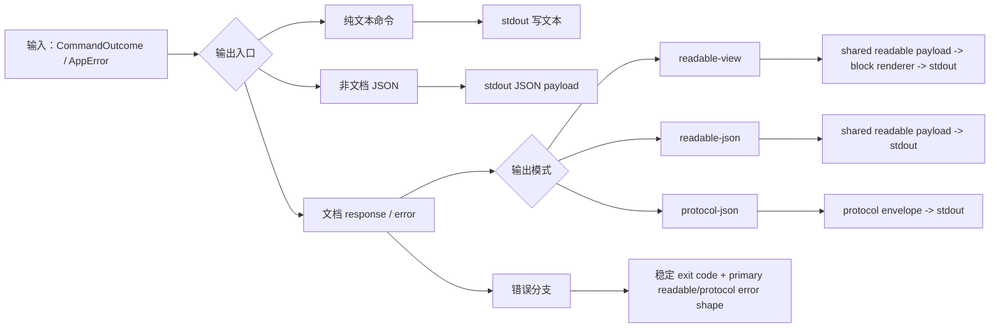
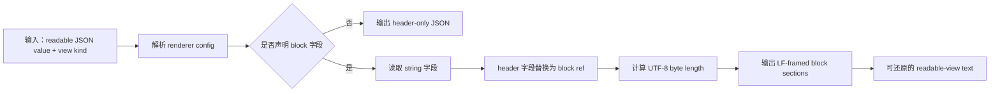
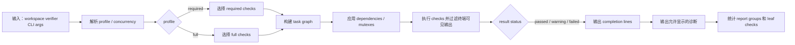
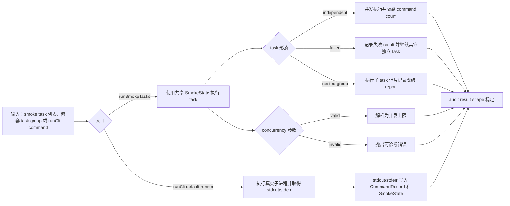
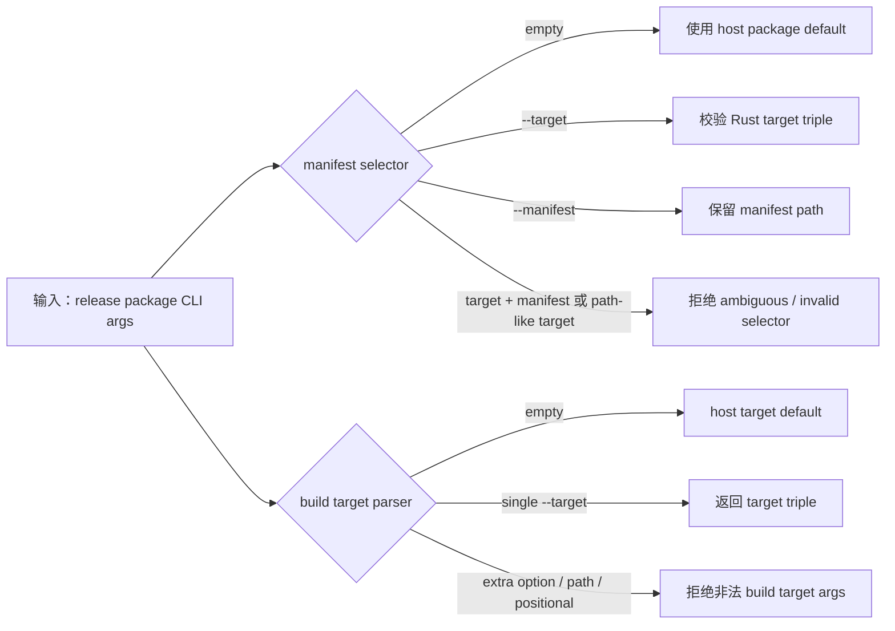

# 测试用例编号账本

## Black-box Cases

### BB-CORE-LINK-001 Core 原样传递真实 Markdown ref
Status: implemented
Existing smoke task: `CORE-LINK-001`
Code: `test/smoke/core/cases/real-markdown.ts`

Proves:
- 真实 `docnav` 进程可以通过 Markdown adapter 完成 `outline -> ref -> read`、`find -> ref -> read` 和 `info` 链路。
- Core 不解析 adapter ref，用户可见 readable JSON 不包含 protocol envelope。

决策说明:
- 保留为一个 smoke case 是因为 `outline`/`find` 产生的 refs、后续 `read` 和 `info` 都复用同一个真实 Markdown project、adapter selection 和 readable-json 入口；拆分会重复 fixture 初始化和 ref 获取模板，而不会增加新的 owner 证明。

### BB-CORE-MD-OPTIONS-001 Markdown max_heading_level option 通过真实 CLI 生效
Status: implemented
Existing smoke task: `CORE-LINK-001`
Code: `test/smoke/core/cases/real-markdown.ts`

Proves:
- Markdown `max_heading_level` 可以从 CLI flag 和 project config 影响 `outline` 可见粒度；越界值作为 adapter-owned option validation error 投影。

### BB-CORE-REF-001 Adapter ref 错误穿过 Core
Status: implemented
Existing smoke task: `CORE-REF-001`
Code: `test/smoke/core/cases/real-markdown.ts`

Proves:
- 被选中 adapter 拒绝的 ref 会从 core 返回稳定 protocol failure。
- `protocol-json` 承载错误时，stderr 不输出 JSON payload。

### BB-CORE-OUTPUT-001 Core 文档输出模式不混层
Status: implemented
Existing smoke task: `CORE-OUTPUT-001`
Code: `test/smoke/core/cases/outputs.ts`

Proves:
- `readable-json`、显式/默认 `readable-view` 和 `protocol-json` 通过各自包装表达同一文档结果。
- readable success output 只包含对应 operation success payload；failure guidance 通过 readable/protocol error projection 表达。
- Unstructured outline selected by config renders through real CLI in readable-json、readable-view 和 protocol-json, preserving content/reason/cost facts while omitting entries/ref/page/continuation.

### BB-CORE-ARGS-001 Core 拒绝缺失的 operation 参数
Status: implemented
Existing smoke task: `CORE-ARGS-001`
Code: `test/smoke/core/cases/cli-args.ts`

Proves:
- document command 缺少本 operation 拥有的必需参数时返回稳定 input failure。
- 该 smoke case 代表这一类外部 CLI 错误，不枚举所有 parser 组合。

### BB-CORE-CONFIG-001 Config source 与 path context 可观察
Status: implemented
Existing smoke task: `CORE-CONFIG-001`
Code: `test/smoke/core/cases/config-management.ts`

Proves:
- 真实 CLI 边界可通过 `config set --user` 存储 user `defaults.pagination.limit` 与 `defaults.pagination.enabled`。
- `config list --path --operation outline` 会报告被选中文档路径对应的 adapter、project `defaults.output`、user pagination values 和 final defaults context。
- disabled pagination 通过 CLI/config 命令可观察为 user config stored value 和 `config list --path` final context；携带显式 numeric `--limit` 的 `outline` 命令仍能成功进入 document command 链路。

### BB-CORE-CONFIG-002 Removed defaults.output=text 通过 config set 被拒绝
Status: implemented
Existing smoke task: `CORE-CONFIG-002`
Code: `test/smoke/core/cases/config-management.ts`

Proves:
- `config set defaults.output text` 返回 input failure，并将 removed output mode 投影为 `INVALID_REQUEST`。
- readable error payload 报告 `defaults.output`、received `text` 和 accepted output modes: `readable-view`、`readable-json`、`protocol-json`。

### BB-CORE-CONFIG-003 Legacy defaults.limit 通过 config source diagnostic 被拒绝
Status: implemented
Existing smoke task: `CORE-CONFIG-003`
Code: `test/smoke/core/cases/config-management.ts`

Proves:
- project config 中的 legacy `defaults.limit` 会在真实 `outline` CLI 链路中返回 config-owned `INVALID_REQUEST`。
- structured `unknown_config_field` / `config_issues` diagnostic 报告字段、source level、path origin 和 config path。

### BB-CORE-CONFIG-004 Native option config 按 selected operation declaration 生效
Status: implemented
Existing smoke task: `CORE-CONFIG-004`
Code: `test/smoke/core/cases/config-management.ts`

Proves:
- project config 中的 `options.max_heading_level` 通过 selected Markdown declaration 影响 `outline` entries。
- user config 中的 `options.max_heading_level` 可通过 `config set --user` 存储；当 `read` operation 不声明 native options 时，返回 structured `unsupported` / `option_issues` diagnostic 并保留 source level。

### BB-CORE-SELECT-001 显式 adapter 失败返回 selection diagnostic
Status: implemented
Existing smoke task: `CORE-SELECT-001`
Code: `test/smoke/core/cases/adapter-selection.ts`

Proves:
- 显式 CLI 或 project config 选择的 adapter 不存在时返回 adapter selection diagnostic，不隐藏为 registry fallback。
- 显式 adapter id 不存在时，即使同一请求携带 invalid-looking native option，也返回 adapter selection diagnostic，而不是 option validation error。

### BB-CORE-FAIL-001 Candidate probe failure 投影为格式候选摘要
Status: implemented
Existing smoke task: `CORE-FAIL-001`
Code: `test/smoke/core/cases/failures.ts`

Proves:
- candidate discovery 阶段的 built-in adapter probe failure 被报告为 `FORMAT_UNKNOWN` candidate summary。
- candidate failure 不会被折叠成 selected adapter layer failure。
- 未显式声明 adapter 的 automatic discovery 全部 probe 失败时，candidate failures 从属于 primary diagnostic details。

### BB-CORE-SOURCE-001 Core adapter source 来自 static registry
Status: implemented
Existing smoke task: `CORE-SOURCE-001`
Code: `test/smoke/core/cases/failures.ts`

Proves:
- core release 内置 adapter dispatch 使用 static registry 中的 linked adapter implementation。
- 默认 document operation 的 implementation source 与项目配置中的普通文件内容解耦。

### BB-CORE-TOOLS-001 Core 非 document 命令保持可用
Status: implemented
Existing smoke task: `CORE-TOOLS-001`
Code: `test/smoke/core/cases/config-management.ts`

Proves:
- `init` 通过真实 CLI 创建 project config。
- `version` 输出 crate version，document help 暴露 output/pagination CLI options。

### BB-CORE-ADAPTER-MGMT-001 Core adapter inspection 命令覆盖
Status: implemented
Existing smoke task: `CORE-ADAPTER-MGMT-001`
Code: `test/smoke/core/cases/config-management.ts`

Proves:
- `doctor` 报告 static registry 和 adapter layer checks。
- `adapter list` 输出 core release static registry 内置 Markdown adapter metadata。

### BB-RELEASE-PACKAGE-001 发布包二进制 smoke
Status: planned

Proves:
- release package 内二进制可执行，manifest、文件集合、校验和和 host/target 选择保持一致。
- package smoke 与 release script 参数解析分层。
- 实现触发条件：release package artifact 生成和 package smoke 进入稳定验证入口后，将本 case 改为 `implemented` 并补 `Code:`/`@case`。

## White-box Cases

### WB-CORE-OUTPUT-001 Core 输出编排保持通道边界
Status: implemented
Code: `crates/docnav/src/output/tests.rs`

Proves:
- Core output assembly 分离 protocol JSON、readable JSON、readable view、stdout、stderr 和 exit code 职责。
- 内部编排覆盖 core 文档输出 smoke 中观察到的分支。
- Core document output facade can render an unstructured outline success through readable-view with `/content` block framing while preserving the stable reason and omitting entries/page.

决策说明:
- 保留为一个多分支 case 是因为所有断言都进入 `write_outcome` / `write_error` 输出编排入口，并共享 stdout/stderr/exit-code projection 基底；拆分会重复构造相同 `CommandOutcome` / `AppError` fixture。

### WB-CORE-HELP-001 Core parser help/version 不进入 document output mode
Status: implemented
Code: `crates/docnav/src/cli/parser/tests.rs`

Proves:
- `--help` 和 operation help 返回 typed help command，并展示当前支持的 document output mode。
- help/version 命令保持非 document command，不携带 document output mode。

### WB-CORE-OUTPUTMODE-001 Core parser document output mode 解析稳定
Status: implemented
Code: `crates/docnav/src/cli/parser/tests.rs`

Proves:
- 未显式传入 `--output` 时 parser 不抢先解析默认值，由 document request/config chain 决定。
- `readable-view`、`readable-json`、`protocol-json` 可解析，合法值集合之外的 output value 返回可诊断错误。

### WB-CORE-ARGS-001 Core parser 保持 operation 参数所有权
Status: implemented
Code: `crates/docnav/src/cli/parser/tests/document_arguments.rs`

Proves:
- operation-owned 参数保持严格校验，例如 `outline --page 0` 会暴露 page 边界错误。
- 未被当前 operation 使用的 known argument 不会被抢先 typed 解析，而是在 parser 边界返回 input diagnostic。

### WB-CORE-ARGS-REPAIR-001 Core parser input diagnostics expose protocol repair context
Status: implemented
Code: `crates/docnav/src/cli/parser/tests/document_arguments.rs`

Proves:
- Unknown document flags、extra document positionals and operation-inapplicable known arguments produce parser diagnostics whose protocol-json error projection preserves reason、received token、expected context and repair guidance.

### WB-NAV-INPUT-RESOLUTION-001 Navigation input resolution 保持来源解析边界
Status: implemented
Code: `crates/docnav-navigation/src/tests/navigation/native_options.rs`

Proves:
- Navigation input resolution preserves source labels for explicit input and project config option issues.
- Adapter descriptor native CLI flags enter parsing as native option sources instead of core-owned fields.
- Selected adapter-owned declarations control native option typed validation/extraction; navigation registers, merges and resolves declared fields.
- Built-in adapter defaults affect the resolved operation result when no explicit/project value is provided.

### WB-NAV-OUTLINE-MODE-001 Navigation outline_mode selectors and pre-dispatch stable
Status: implemented
Code: `crates/docnav-navigation/src/tests/navigation/outline_mode.rs`

Proves:
- path rules use deterministic source/order priority, can select unstructured full read, and can opt out to structured before cost thresholds run.
- adapter-scoped cost thresholds filter by selected adapter, merge same-unit thresholds to the minimum value, request only declared units, and fall back to structured when measurement is missing or unavailable.
- outline config source shape rejects an unregistered `outline.*` key and an unregistered `outline.mode_rules[]` item key before selector parsing and reports the source-scoped field path.
- unstructured full-read pre-dispatch skips the normal outline handler and returns either default UTF-8 content, adapter hook content with selector cost, or adapter hook result facts with stable `path_rule` / `cost_threshold` reasons.
- path-triggered default full-read returns a controlled non-UTF-8 failure instead of producing lossy content.

### WB-CORE-PREFLIGHT-001 Core preflight 检测 protocol-json intent
Status: implemented
Code: `crates/docnav/src/cli/preflight/tests.rs`

Proves:
- Core preflight 可以在解析失败前识别空格分隔和等号形式的 `--output protocol-json`。
- 该识别只服务错误输出模式选择，不替代正式 parser。

### WB-CORE-ADAPTER-001 Core 校验 adapter contract 对齐
Status: implemented
Code: `crates/docnav/src/registry/tests.rs`

Proves:
- Core static registry 包含 release 内置 Markdown adapter descriptor metadata。
- Core static registry exposes Markdown native option config keys and outline native option specs.
- Adapter layer check 将 manifest id 与 registry id 不一致视为 adapter layer invalid。

### WB-CORE-ADAPTER-SURFACE-001 Core adapter command surface 保持静态注册表边界
Status: implemented
Code: `crates/docnav/src/cli/parser/tests.rs`

Proves:
- `adapter list` 解析为 static registry inspection command。
- 默认 adapter command surface 只接受 `adapter list` 作为 inspection command。

### WB-NAV-ADAPTER-SOURCE-001 Navigation adapter selection 保持静态来源边界
Status: implemented
Code: `crates/docnav-navigation/src/tests/navigation/adapter_source.rs`

Proves:
- 显式声明的 adapter id 不存在于 static registry 时返回 `ADAPTER_UNAVAILABLE`。
- diagnostic owner 来自 `docnav-navigation` routing，而不是 core routing。
- guidance 指向 current core release static registry，且不提示 install/register/executable/artifact 旧动态入口。
- Automatic discovery 全部候选失败时返回 `FORMAT_UNKNOWN`，并把 routing-owned probe failure reason 投影到 primary details 的 `candidate_failures`。
- 本 case 不证明 discovery 顺序、extension metadata 排序或 manifest metadata 与 candidate failure 的关系。

### WB-DIAG-RULES-001 Diagnostics code rules 保持稳定
Status: implemented
Code: `crates/docnav-diagnostics/src/tests/code_rules.rs`

Proves:
- `DiagnosticCode::all()` exposes the current diagnostic registry, including representative protocol and boundary diagnostic codes.
- Each registry code exposes a non-empty unique stable string, details rule, category, severity, effect and declared diagnostic projection route.

### WB-DIAG-RECORD-001 Diagnostic record construction validates typed details
Status: implemented
Code: `crates/docnav-diagnostics/src/tests/record.rs`

Proves:
- `DiagnosticRecordDraft::into_record()` creates primary records with code defaults, typed details, source and absent guidance preserved.
- Record construction rejects empty summaries and erased details whose shape does not match the diagnostic code.
- Format diagnostic details can carry subordinate `candidate_failures` in the primary record details object.

### WB-CLIARGS-BOUNDARY-001 Strict CLI 参数扫描保持输入边界
Status: implemented
Code: `crates/docnav-cli-args/src/tests.rs`

Proves:
- unknown flag 不消费后续 positional，used value flag 保留值，unused value flag 记录 operation applicability failure。
- switch flag、missing value、extra positional 和 unknown token 边界保持可观察，并可映射为 input diagnostic。

### WB-JSONIO-WRITE-001 JSON writer 保持格式和错误分类
Status: implemented
Code: `crates/docnav-json-io/src/tests.rs`

Proves:
- compact/pretty JSON 都以换行结束。
- serialization failure 和 writer failure 保持不同错误类型。

### WB-OUTPUT-DOCUMENT-001 共享 document output facade 分层
Status: implemented
Code: `crates/docnav-output/src/tests.rs`

Proves:
- readable JSON success 不带 protocol envelope，protocol JSON success 只输出 protocol envelope。
- readable-view read 使用 block renderer，readable error 保留 primary diagnostic code、owner、details 和 guidance。
- readable read 的成本摘要由 `cost.measurements[]` 派生，并保留对非 bytes/lines measurement unit 的通用摘要。
- outline readable output covers the structured discriminator and the unstructured branch across readable-json、readable-view and protocol-json, including stable reason, stable cost facts and absence of entries/ref/page/continuation.

决策说明:
- 保留为一个 facade case 是因为 success/error、readable/protocol 和 structured/unstructured 分支都复用 `docnav-output` document facade 和同一 result/diagnostic projection helpers；这里证明输出矩阵，不重新证明 navigation selector 或 adapter behavior。

### WB-TEXT-COST-001 Shared text cost helper 保持纯文本边界
Status: implemented
Code: `crates/docnav-text-cost/src/tests.rs`

Proves:
- shared text cost helper functions 只接收纯文本并返回 unscoped protocol-compatible `Measurement`。
- `line_cost`、`byte_cost` 和 `token_cost` 分别固定 `lines`、`bytes`、`tokens` unit，并覆盖空文本、Unicode bytes、换行和 plain-text `o200k_base` token counting。

### WB-READABLE-RENDERER-001 Readable renderer success path block/framing 规则
Status: implemented
Code: `crates/docnav-readable/src/renderer/tests/success.rs`

Proves:
- readable-view header、block replacement、UTF-8 byte length、LF framing、extension fields 和 operation-specific block/no-block config 保持稳定。
- readable error payload、header standalone JSON 和 default config success path 保持可还原。

决策说明:
- 保留 block/framing 成功矩阵为一个 case 是因为这些断言共享 renderer config、readable value fixture 和可还原 readable-view 文本基底；拆分成按 operation 的 case 会重复 header/block parsing 模板。
- `to_readable_value` 当前证明目标限定为有效 typed payload -> readable JSON value。serialization failure 需要人工构造 failing `Serialize` 才能触发，不登记为独立证明目标；若 production readable payload 引入非平凡序列化失败风险，再新增窄单测覆盖该分支。

### WB-READABLE-RENDERER-002 Readable renderer config/error 边界稳定
Status: implemented
Code: `crates/docnav-readable/src/renderer/tests/errors.rs`

Proves:
- renderer 可以区分 missing pointer、non-string target、duplicate pointer 和 pointer syntax。
- renderer failure 使用稳定 error id `readable_view_render_failed`。

### WB-READABLE-VIEW-001 Readable-view conformance vectors 被测试消费
Status: implemented
Code: `crates/docnav-readable/tests/conformance_tests.rs`

Proves:
- readable-view conformance fixture set 由测试执行，保持 fixture 与 renderer contract 同步。
- renderer framing、block extraction、readable error projection 和 extension-field case 由 fixture-driven assertions 覆盖。
- fixture coverage includes unstructured outline `/content` block rendering while keeping kind、reason and empty cost facts in the readable-view header.

决策说明:
- 保留为一个 conformance-vector case 是因为 fixture harness 已把不同 vectors 统一为同一 header/block/payload assertion model；拆分会重复 harness 调度，且不会改变 owner 边界。

### WB-PROTO-BASIC-001 Protocol 基础类型和 envelope 规则稳定
Status: implemented
Code: `crates/docnav-protocol/src/tests/basic.rs`

Proves:
- positive integer、generated request id、success response 和 failure operation preservation 保持协议基础不变量。
- outline success response coverage includes structured and unstructured discriminator branches, including the unstructured no entries/ref/page/continuation boundary.

### WB-PROTO-DIAGNOSTICS-001 Protocol diagnostic mapping and projection 保持稳定
Status: implemented
Code: `crates/docnav-protocol/src/tests/basic.rs`

Proves:
- Protocol diagnostic codes map to protocol error categories and their diagnostic projection rules expose the protocol code.
- Protocol error required details stay aligned with diagnostic typed-code rules.
- Navigation routing protocol errors expose static-registry guidance, and protocol errors round-trip through `DiagnosticRecord` projection while preserving guidance.
- Invalid-request records with config issue details project protocol owner, location and received value from the diagnostic record.

### WB-PROTO-DECODE-001 Protocol request decode 按阶段失败
Status: implemented
Code: `crates/docnav-protocol/src/tests/decode.rs`

Proves:
- Protocol request decoding runs schema/field-contract validation before raw typed decode.
- Protocol request decoding rejects unmapped request arguments at the schema stage.
- Protocol request decoding preserves defaultable empty arguments for operation-specific later resolution.
- Probe result semantic validation and protocol response operation/result pairing remain semantic-stage failures.

### WB-PROTO-SCHEMA-001 Protocol fixtures 和 schema constraints 被实现测试消费
Status: implemented
Code: `crates/docnav-protocol/src/tests/schema.rs`

Proves:
- 已文档化的 protocol fixtures 仍能通过 public JSON Schema、runtime typed contract validation，并 deserialize 为共享 protocol types。
- protocol request、protocol response、manifest 和 probe 的 unknown fields、missing required fields、wrong types、version constants、field constraints 和 semantic boundary 被实现测试消费。

### WB-TYPED-FIELDS-001 Typed field definition core 保持字段级不变量
Status: implemented
Code: `crates/docnav-typed-fields/src/tests/field_model.rs`

Proves:
- Builder 生成 field identity、processing strategy-backed structured path、`FieldValidation<T>`、typed default metadata 和 schema metadata view，并能把合法 JSON value 校验为 typed value。
- Field metadata validation 区分 missing optional、wrong type 和 range violation，并保留 field identity、field path 和 machine-readable reason。
- Required enum field declaration 使用 Rust enum metadata 校验 allowed value，missing required 和 disallowed enum value 返回可诊断 validation failure。

### WB-TYPED-FIELDS-PRESENCE-001 Typed field declaration presence policy 稳定
Status: implemented
Code: `crates/docnav-typed-fields/src/tests/field_presence.rs`

Proves:
- `T` / `Option<T>` field declaration 分别投影为 required/non-nullable 和 optional/nullable schema metadata。
- missing required 和 null required 分别返回 `MissingRequired` 与 typed wrong-null failure。
- optional field 在 missing、null 和 present 三种输入下分别产生 `None`、`None` 和 typed value。
- 手动 field shape 可表达 required-but-nullable contract field，missing 仍失败，present null 可通过。

### WB-TYPED-FIELDS-METADATA-001 Typed field metadata build invariants 稳定
Status: implemented
Code: `crates/docnav-typed-fields/src/tests/field_metadata.rs`

Proves:
- duplicate field identity 在 definition set build 阶段失败，并保留 previous/current declaration path 和 processing path。
- String enum metadata 由真实 Rust enum metadata 驱动：空 enum metadata 在 build 阶段失败，重复 enum string alias 在有效 metadata 中去重，typed extraction 返回 enum value。

### WB-TYPED-FIELDS-CONSTRAINTS-001 Typed field string/array constraints 稳定
Status: implemented
Code: `crates/docnav-typed-fields/src/tests/constraints.rs`

Proves:
- String regex、closed minimum length 和 open maximum length 对 present value 产生稳定 validation failure reason。
- Array length 和 unique-items constraints 对 present value 生效。
- Invalid regex metadata 在 definition set build 阶段失败。

### WB-TYPED-FIELDS-RANGES-001 Typed field numeric ranges and defaults 稳定
Status: implemented
Code: `crates/docnav-typed-fields/src/tests/field_ranges.rs`

Proves:
- Numeric range 按字段 Rust value type 绑定：`int()` 使用 integer bound 并覆盖大整数精度边界，`num()` 使用 finite floating bound；open/closed empty range 在 build 阶段失败。
- Static default metadata 通过 field validation；invalid default、non-finite default、non-finite range 和 empty range 在 build 阶段失败。

### WB-TYPED-FIELDS-PROCESSING-001 Typed field processing build 稳定
Status: implemented
Code: `crates/docnav-typed-fields/src/tests/processing.rs`

Proves:
- Processing build 接受 processing id 和 caller-provided function，可以用 typed raw input 返回 caller processing result；typed-fields 不解释处理函数内部语义。
- Empty processing id 在 build 阶段失败。
- Field set build rejects a leaf declaration without a processing strategy and preserves the declaration path in the build error.

### WB-TYPED-FIELDS-PROJECTION-001 Typed field definition set projection 稳定
Status: implemented
Code: `crates/docnav-typed-fields/src/tests/set_projection.rs`

Proves:
- FieldDefSet 汇总字段定义，`#[derive(FieldDefs)]` 的 Rust struct 生成 typed values object shape，`#[field(group)]` 表达嵌套对象。
- JSON helper 组合 FieldDefSet metadata/validation，在同一 processing id 下返回 extraction result 和 processing result；即使 extraction result 为 validation error，processing result 仍可交给 caller，未配置 passthrough processing 时保留原始 JSON，并可按 declared JSON path 计算当前 object 的未消费键。
- 处理入口和投影 API 产出同形 typed values object、value kind view、typed default values object 和 schema metadata view；`process_with_static_defaults(processing, json)` 只用 static default 填补缺失输入，`default_values()` 对缺少 static default 的 leaf 返回 `None`，`to_builder()` 支持静态覆盖 leaf builder 后重新 build，动态 identity-string field lookup 不属于 API。
- Field builder 可以按 processing id 声明处理策略且不再支持 `.path(...)` 兼容入口；同一 definition set 内相同 processing id 必须使用相同 input kind，JSON path processing strategy 可以产出同形 typed values object。

### WB-TYPED-FIELDS-COMPILE-001 FieldDefs derive 拒绝非法声明
Status: implemented
Code: `crates/docnav-typed-fields/tests/field_defs_compile.rs`

Proves:
- `FieldDefs` derive 在编译期拒绝 leaf Rust field 类型与 `FieldDefBuilder<T>` 类型不一致的声明。
- 缺少 field validation 或缺少 `#[field(...)]` attribute 的声明无法通过 trybuild compile-fail fixtures。

### WB-PARAM-RESOLVE-001 Navigation input resolution helper 保持来源解析边界
Status: implemented
Code: `crates/docnav-parameter-resolution/src/tests.rs`

Proves:
- Navigation input resolution helper consumes typed-field metadata to produce typed runtime values with source info, using fixed `direct input > project config > user config > default` priority.
- Processing-specific metadata projection and navigation parameter bindings construct direct input, project config, user config and default sources before resolution.
- Missing required values, invalid mapped values, optional mapped JSON null, static defaults and dynamic default source values all pass through typed-field validation and do not expose unsafe typed values.
- Explicit or present invalid config sources return blocking config diagnostics while default missing config sources remain absent without diagnostics.
- Unmapped public input returns source-scoped blocking diagnostics；owner-scoped native option sources are resolved through selected-adapter typed-field validation/extraction with source info preserved.
- Adapter option declarations preserve owner/namespace/type variants, including same option name across multiple owners or value kinds, and generic merge does not collapse them into a single core type.
- Navigation input resolution hands off final native option values after selected-adapter typed-field filtering and validation/extraction.
- Operation argument binding records identity-to-arguments-path metadata while preserving the resolved source info; request construction remains outside the resolver.

### WB-CONTRACTS-ERROR-001 Adapter contracts error mapping 保持 protocol 投影边界
Status: implemented
Code: `crates/docnav-adapter-contracts/src/tests.rs`

Proves:
- Adapter document errors project to protocol error code, owner, location and default guidance through `AdapterError::protocol_error()`.
- Adapter-owned native option errors project issue metadata to invalid-request received, expected, details and guidance fields.

### WB-CONTRACTS-NATIVE-001 Adapter contracts 声明 native option typed fields
Status: implemented
Code: `crates/docnav-adapter-contracts/src/tests.rs`

Proves:
- `AdapterOptionSpec` wraps typed-field declaration, source bindings, validation and static default metadata without owning the use-site registration step.
- Direct registration into a typed-field set preserves identity、`options.*` final arguments path、value kind、static default 和 operation applicability, so navigation does not reconstruct adapter-owned validation semantics.

### WB-CONTRACTS-UNSTRUCTURED-001 Adapter contracts unstructured full-read hook defaults 稳定
Status: implemented
Code: `crates/docnav-adapter-contracts/src/tests.rs`

Proves:
- Adapter contract default unstructured full-read capabilities are absent unless the adapter opts in.
- Default unstructured full-read content hook returns an adapter error, cost measurement returns an empty `Cost`, and result facts return defaults.

### WB-NAVIGATION-DISPATCH-001 Navigation config source loading and dispatch 稳定
Status: implemented
Code: `crates/docnav-navigation/src/tests/navigation/config_sources.rs`

Proves:
- `docnav-navigation` 接收 config source descriptor paths 并由 navigation boundary 加载 project/user raw config sources。
- Project config source values participate in selected adapter option resolution and dispatch, producing the expected protocol success result.
- Nested non-object config source shapes at `defaults`、`defaults.pagination` 和 `options` return navigation-owned typed input errors.

### WB-MD-REF-GRAMMAR-001 Markdown ref grammar 稳定
Status: implemented
Code: `crates/docnav-markdown/src/markdown/refs/tests.rs`

Proves:
- canonical heading ref 由 line 和 level 结构字段构成。
- parser 将前导零、非法 level、zero line、非数字字段、缺失/额外字段、错误 prefix 和 `doc:full` 映射到 grammar 外输入。
- `doc:full` sentinel 的保留语义由 Markdown ref matching case 覆盖；本 case 只证明 grammar parser 不把它当作 heading ref。

### WB-MD-REF-MATCH-001 Markdown parsed ref 精确匹配 heading 坐标
Status: implemented
Code: `crates/docnav-markdown/src/markdown/refs/tests.rs`

Proves:
- parsed heading ref 在 line 和 level 同时匹配时命中目标 heading。
- matcher 的命中条件由 parsed ref 的 line 和 level 决定。
- `FULL_DOCUMENT_REF` 保留 adapter-owned full document sentinel `doc:full`。

### WB-MD-PARSE-001 Markdown parser 忽略非 heading 结构
Status: implemented
Code: `crates/docnav-markdown/src/markdown/tests.rs`

Proves:
- code fence pseudo heading、invalid heading 和 frontmatter 不进入 heading model。
- section boundary 按 Markdown heading 层级截断。

### WB-MD-OUTLINE-001 Markdown outline ref 和 display 语义稳定
Status: implemented
Code: `crates/docnav-markdown/src/markdown/tests.rs`

Proves:
- outline 生成 canonical ref，重复 title/path 不影响 ref，max heading level 只影响可见性。
- deep-only document 在当前可见层级下 fallback 到 `doc:full`。
- outline cost 按 `lines`、`bytes`、`tokens` 顺序报告 entry-scoped measurements，display 保留 title/cost，但 ref 不包含展示文本。

### WB-MD-ADAPTER-OUTLINE-001 Markdown adapter outline 默认层级和 fallback 稳定
Status: implemented
Code: `crates/docnav-markdown/tests/adapter/outline_ref.rs`

Proves:
- adapter outline 默认显示 H1-H3，并忽略 code fence 内 heading 和超出默认层级的 heading。
- 没有 visible heading 时 fallback 到 `doc:full`，且 read 能返回完整文档。

### WB-MD-READ-001 Markdown read resolve 和 doc:full ref 稳定
Status: implemented
Code: `crates/docnav-markdown/src/markdown/tests.rs`

Proves:
- canonical ref 可解析到 heading，`doc:full` 可解析完整文档。
- 符合 canonical grammar 但缺少匹配项的 ref 返回 `REF_NOT_FOUND`。
- grammar 外输入返回 `REF_INVALID`。

### WB-MD-LINK-001 Markdown outline/find ref 可通过 read roundtrip
Status: implemented
Code: `crates/docnav-markdown/src/markdown/tests.rs`

Proves:
- Markdown navigation 生成的 outline entry ref 可以直接传给 read。
- find 生成的 ref 也可通过同一本地 parser/formatter 路径解析。

### WB-MD-REF-001 Markdown 重复标题生成唯一可读 ref
Status: implemented
Code: `crates/docnav-markdown/tests/adapter/outline_ref.rs`

Proves:
- 重复 heading path 会生成唯一 ref，且每个 ref 都能读取目标 section。
- Markdown ref generation 和 read lookup 仍由 adapter 拥有。

### WB-MD-REF-002 Markdown ref 错误区分 invalid 和 not-found
Status: implemented
Code: `crates/docnav-markdown/tests/adapter/outline_ref.rs`

Proves:
- grammar 外输入返回 `REF_INVALID`。
- 符合 canonical grammar 且当前结构缺少匹配 section 的 ref 返回 `REF_NOT_FOUND`。
- 文档结构变化后的先前 ref 由当前结构重新判定。

### WB-MD-PAGE-001 Markdown read 分页按 Unicode 字符计数
Status: implemented
Code: `crates/docnav-markdown/tests/adapter/paging_find.rs`

Proves:
- Markdown read pagination 按 Unicode 字符计数，不拆分字符。
- page 前进和结束状态可通过返回的 page metadata 观察。
- read cost 使用 selection-scoped helper measurements；token cost 不参与分页预算。

### WB-MD-PAGE-002 Markdown outline/find pagination 保持 continuation
Status: implemented
Code: `crates/docnav-markdown/tests/adapter/paging_find.rs`

Proves:
- outline 和 find 结果按 response page 继续读取直到结束。
- past-end page 返回空结果且不产生 continuation。

### WB-MD-PAGING-DISPLAY-001 Markdown paging helper 保留 ref 并截断 display
Status: implemented
Code: `crates/docnav-markdown/src/paging/tests.rs`

Proves:
- Markdown paging helper 对 Unicode 计数一致。
- display 预算不足时截断 display 而不截断 ref，并在有空间时保留 ellipsis marker。

### WB-MD-FIND-001 Markdown find ref 和 display 语义稳定
Status: implemented
Code: `crates/docnav-markdown/tests/adapter/paging_find.rs`

Proves:
- find 匹配 hidden heading 或 heading 前内容时，ref 指向当前 visible region 或 full document fallback。
- find display 保留匹配片段且 ref 不受 display 内容影响。

### WB-MD-OPTIONS-001 Markdown typed option 控制可见粒度
Status: implemented
Code: `crates/docnav-markdown/tests/adapter/options_error_display.rs`

Proves:
- `max_heading_level` options 同时影响 outline 和 find 的 visible heading granularity。
- `max_heading_level` 通过 Markdown `AdapterOptionSpec` declaration、selected adapter declaration registration 和 typed-field validation/extraction 进入 request construction，options shape 保持 adapter-owned，不上移为 core-owned 字段。
- Markdown adapter 只证明已校验 typed option value 对 outline/find visible heading granularity 的业务效果；default、type、range 和 unsupported validation 由 `docnav-navigation` 在 handler dispatch 前完成。

### WB-MD-META-001 Markdown manifest/probe/info 元数据稳定
Status: implemented
Code: `crates/docnav-markdown/tests/adapter/meta.rs`

Proves:
- manifest 声明 Markdown v0 identity 和 format metadata，probe 返回 format evidence 而不泄漏 navigation payload。
- info 返回 Markdown summary。

### WB-MD-ERROR-001 Markdown adapter document error 稳定
Status: implemented
Code: `crates/docnav-markdown/tests/adapter/options_error_display.rs`

Proves:
- non-UTF-8 document 返回稳定 encoding error。

### WB-MD-DISPLAY-001 Markdown outline/find display 保留可读文本
Status: implemented
Code: `crates/docnav-markdown/tests/adapter/options_error_display.rs`

Proves:
- outline display 包含 heading title，find display 包含 match snippet。
- display 不进入 ref，不影响 adapter-owned ref 语义。

## Auxiliary Script Cases

### AUX-WORKSPACE-VERIFY-001 Workspace verifier 保持 required/full profile 语义
Status: implemented
Code: `scripts/docnav-workspace/verify.test.ts`

Proves:
- required 和 full verifier profile 保持区分。
- profile membership、check label、arguments、dependencies、mutex 和 report counting 由 verifier tests 明确证明。
- required profile 显式包含 case catalog docs validator 和 validator script tests。
- required profile 包含 quick quality check；full profile 使用 full quality check 替代 quick quality check，并追加更宽验证。
- full profile 的 quality check 使用 verifier 输出；只有未带 `acceptedReason` 的 quality warning 会映射为 verifier warning。
- completion line 和 summary 可区分 passed、warning 和 failed。
- 输出过滤规则由 verifier 配置维护；终端输出保留状态摘要和可行动诊断，完整子命令输出写入 verifier log。

### AUX-SMOKE-HARNESS-001 Smoke harness 正确记录 task 和 command 输出语义
Status: implemented
Code: `test/tools/smoke-harness.test.ts`

Proves:
- independent smoke tasks 可以并发运行，同时 command count 按 report 隔离。
- failed task、nested task group、默认 runner 的 stdout/stderr command record 和 concurrency validation 保持预期 audit result shape。
- core smoke repository temp root 在运行前创建并在运行结束后清理；清理失败或残留不得改变 command output contract。

### AUX-PARALLEL-RUNNER-001 Parallel task runner 保持调度契约
Status: implemented
Code: `scripts/tools/parallel-task-runner/index.test.ts`

Proves:
- task normalization、concurrency、mutex serialization、dependency ordering 和 nested task expansion 保持稳定。
- prepare strategy、invalid list metadata、duplicate id 和 unknown dependency failure 保持可诊断。

决策说明:
- 保留为一个 runner case 是因为 normalize、prepare、graph validation 和 scheduler constraints 形成同一 task graph pipeline；各分支共享 `NormalizedTask` shape 和 event-order harness。

### AUX-QUALITY-PARSER-001 Quality scanner parser fixtures 稳定
Status: implemented
Code: `scripts/tools/quality/measurement/scanners.test.ts`

Proves:
- scc 3.7 by-file CSV 解析 Provider path 和 `Complexity` decision-token value，并将未知 header 投影为 parser failure。
- Lizard 1.23 CSV row 解析 function name、file path、line range、NLOC、parameter count 和 cyclomatic complexity。
- PMD CPD parser helpers 解析 code-area language、version output 和 XML duplicate fragment locations/token count。

### AUX-QUALITY-CPD-WRAPPER-001 Quality PMD CPD wrapper failure projection 稳定
Status: implemented
Code: `scripts/tools/quality/measurement/scanners.test.ts`

Proves:
- PMD CPD wrapper 将 exit 4 且 empty output 的工具结果映射为 skipped scan failure diagnostic，错误文本保留 exit code 和 `no output` 原因。

### AUX-QUALITY-CACHE-001 Quality measurement cache identity 稳定
Status: implemented
Code: `scripts/tools/quality/measurement/cache.test.ts`

Proves:
- duplicate-code cache key changes for tested code area and input fingerprint differences, and cache lookup misses when tool version differs.
- duplicate-code cache entry 使用 `.cache/docnav/quality/<scan_cache_version>/` 作为 owner 目录。
- cache hit 返回不带 changed-scope annotation 的 metric，保持复用扫描与当前 diff 语义分离。
- baseline snapshot cache key changes for tested tool version differences，命中时通过 snapshot hash 防止错读缓存内容。

### AUX-QUALITY-CPD-TASK-001 Quality CPD task planning 稳定
Status: implemented
Code: `scripts/tools/quality/measurement/scanners/pmd-cpd/area-scans.test.ts`

Proves:
- PMD CPD 每个 code area 生成一个 scan task。
- task id 和文件排序保持可复现。

### AUX-QUALITY-FINGERPRINT-001 Quality input fingerprint 稳定
Status: implemented
Code: `scripts/tools/quality/input/files.test.ts`

Proves:
- quality input fingerprint 使用排序后的文件内容生成稳定 SHA-256。
- 文件内容变化会改变 fingerprint，文件顺序变化不会改变 fingerprint。

### AUX-QUALITY-GIT-PATHSPEC-001 Quality git pathspec 参数稳定
Status: implemented
Code: `scripts/tools/quality/input/files.test.ts`

Proves:
- quality input git pathspec 参数使用显式 `--` 分隔并保留 glob pathspec magic。
- 空 pathspec 可按调用方需要保留 `--` 或完全省略。

### AUX-QUALITY-CHANGED-FILES-001 Quality changed-file input explicit list failure 稳定
Status: implemented
Code: `scripts/tools/quality/input/files.test.ts`

Proves:
- quality changed-file input 将 unreadable explicit `--changed-files` path 映射为 thrown diagnostic，错误文本保留 flag 名称和请求的文件路径。

### AUX-QUALITY-CODE-AREAS-001 Quality code area 分类稳定
Status: implemented
Code: `scripts/tools/quality/model/code-areas.test.ts`

Proves:
- smoke case 和 fixture 文件归入 `fixtures-examples`，不被 `typescript-validation-smoke` 的广泛 globs 遮蔽。
- smoke harness 和 validator infrastructure 仍归入 `typescript-validation-smoke`。
- quality scan input globs 覆盖 Rust source、TypeScript scripts 和 TypeScript tests；code area globs 将 production scripts 与 validation/smoke TypeScript 分开。

### AUX-QUALITY-REPORT-001 Quality report 排名和 changed-file 摘要稳定
Status: implemented
Code: `scripts/tools/quality/output/report/markdown-report.test.ts`

Proves:
- baseline unavailable 时 changed-file watchlist 仍按风险展示有用文件。
- rankings 排序不修改 scanner output 原始顺序。
- scc `Complexity` 文件列在人类报告中展示为 decision-token count，并补充 `file-decision-tokens / total-file-decision-tokens` 热点占比。
- Code Area 汇总表展示 decision-token count 和总量占比，用于定位热点区域。
- 带 `acceptedReason` 的 warning 在报告中贴近对应 warning 展示原因，不从单独质量扫描中消失。

### AUX-QUALITY-WARNINGS-001 Quality warning 阈值语义稳定
Status: implemented
Code: `scripts/tools/quality/output/warnings/generator.test.ts`

Proves:
- 文件大小 warning 使用 scc `Code` 代码行数，而不是包含注释和空行的总行数。
- 文件大小 warning 根据 scc decision-token count 选择 code-line floor，低 decision-token 文件可使用更高行数阈值。
- warning record 的 rule id、metric、message 和 suggestion 反映代码行数、阈值和 responsibility-focused guidance。
- 函数 warning 使用复杂度感知的代码密度阈值：普通复杂度函数超过 50 行触发，CC < 5 的简单函数超过 150 行才触发。
- 函数代码密度 warning record 的 rule id、metric 和 message 反映组合阈值语义，不再输出单纯函数代码行数规则。
- 已知可接受 warning 保留在 all/changed/regression warning records 中，并通过 `acceptedReason` 字段携带原因。
- accepted warning 匹配不依赖重复片段行号；匹配不到任何 generated warning 的 accepted rule 会生成 `quality-accepted-warning-unmatched` warning。

### AUX-QUALITY-SCAN-CLI-001 Quality scan CLI 默认值稳定
Status: implemented
Code: `scripts/tools/quality/scan-command/index.test.ts`

Proves:
- quality scan 默认跳过 baseline，baseline generation 保持 opt-in。
- quality scan profile 默认为 full；quick profile 固定跳过 baseline，并拒绝 baseline 参数。
- quality scan 的 `--verification-output` flag parsing 保持 opt-in。
- changed file collection 在 CLI defaults 下仍能解析当前 changed scope。

### AUX-RELEASE-ARGS-001 Release package 参数解析保持边界
Status: implemented
Code: `scripts/tools/release-package/args.test.ts`

Proves:
- release package selector 区分 host package default、target triple、manifest path 和 ambiguous selector。
- build target parser 区分 host default、single target 和非法 extra options/path。

### AUX-CASE-CATALOG-001 Case catalog validator 覆盖 planned/status/path 语义
Status: implemented
Code: `scripts/tools/validators/case-catalog/index.test.ts`

Proves:
- case catalog validator accepts implemented cases with matching markers and planned cases without markers.
- case catalog validator reports duplicate documented IDs、duplicate source markers、invalid marker IDs、invalid `Status:`、implemented case without `Code:`、documented implemented cases missing markers、undocumented source markers、planned cases with markers and `Code:` path drift.
- 真实仓库由 `bun run validate:docs cases` 作为集成验证。

决策说明:
- 保留为一个 validator taxonomy case 是因为 success 与 failure labels 都来自同一 case catalog snapshot validator；一个 synthetic catalog 可以覆盖 status、marker 和 path drift 分类，避免复制 document/marker fixture。
