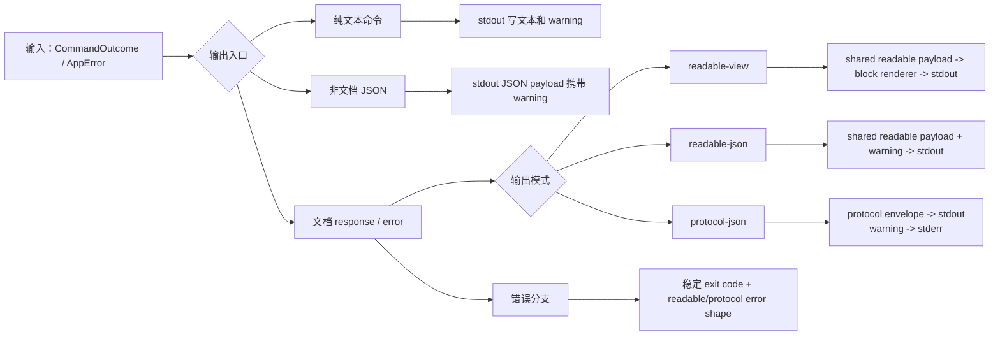
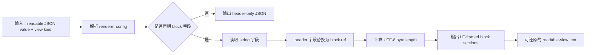
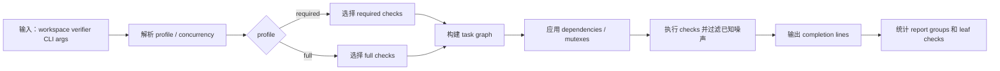
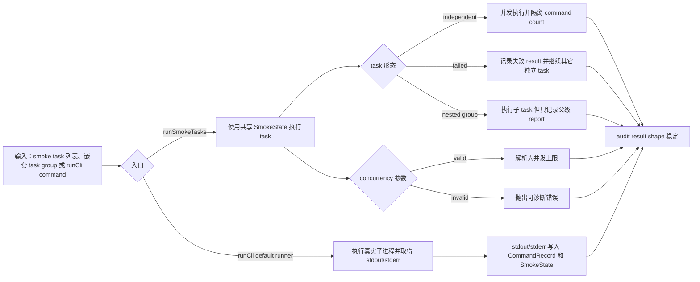
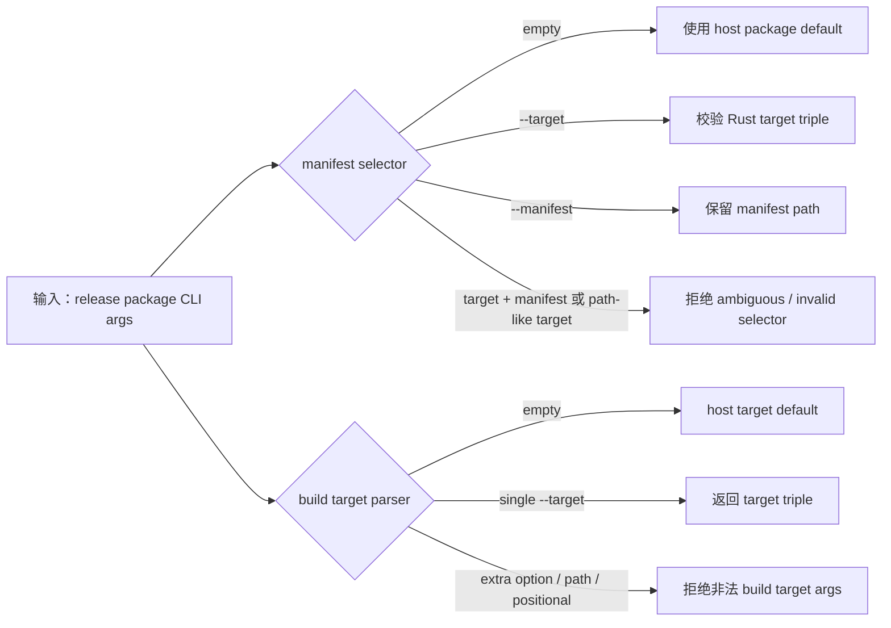

# 测试用例编号账本

## Black-box Cases

### BB-CORE-LINK-001 Core 原样传递真实 Markdown ref
Status: implemented
Existing smoke task: `CORE-LINK-001`
Code: `test/smoke/core/cases/real-markdown.ts`

Proves:
- 真实 `docnav` 进程可以通过 Markdown adapter 完成 `outline -> ref -> read`、`find -> ref -> read` 和 `info` 链路。
- Core 不解析 adapter ref，用户可见 readable JSON 不包含 protocol envelope。

### BB-CORE-REF-001 Adapter ref 错误穿过 Core
Status: implemented
Existing smoke task: `CORE-REF-001`
Code: `test/smoke/core/cases/real-markdown.ts`

Proves:
- 被选中 adapter 拒绝的 ref 会从 core 返回稳定 protocol failure。
- `protocol-json` 承载错误时，stderr 不输出 JSON payload。

### BB-CORE-OUTPUT-001 Core 文档输出模式不混层
Status: implemented
Existing smoke task: `CORE-OUTPUT-001`
Code: `test/smoke/core/cases/outputs.ts`

Proves:
- `readable-json`、显式/默认 `readable-view` 和 `protocol-json` 通过各自包装表达同一文档结果。
- `readable-view` warning 保留在 stdout，并保持 readable warning schema 有效。

### BB-CORE-ARGS-001 Core 拒绝缺失的 operation 参数
Status: implemented
Existing smoke task: `CORE-ARGS-001`
Code: `test/smoke/core/cases/cli-args.ts`

Proves:
- document command 缺少本 operation 拥有的必需参数时返回稳定 input failure。
- 该 smoke case 代表这一类外部 CLI 错误，不枚举所有 parser 组合。

### BB-CORE-CONFIG-001 配置优先级和 path context 可观察
Status: implemented
Existing smoke task: `CORE-CONFIG-001`
Code: `test/smoke/core/cases/config-management.ts`

Proves:
- 真实 CLI 边界按文档优先级解析 user、project 和 default config。
- `config list --path` 会报告被选中文档路径对应的 adapter 和 defaults context。

### BB-CORE-SELECT-001 显式 adapter 失败后 fallback 并报告 warning
Status: implemented
Existing smoke task: `CORE-SELECT-001`
Code: `test/smoke/core/cases/adapter-selection.ts`

Proves:
- 显式选择的 adapter 失败时不会隐藏 registry fallback。
- `readable-json` 结果携带被拒绝 adapter 的 candidate warning evidence。

### BB-CORE-FAIL-001 Candidate 进程失败保留为发现阶段证据
Status: implemented
Existing smoke task: `CORE-FAIL-001`
Code: `test/smoke/core/cases/failures.ts`

Proves:
- candidate discovery 阶段的进程失败被报告为 `FORMAT_UNKNOWN` evidence。
- candidate failure 不会被折叠成 selected adapter invoke failure。

### BB-CORE-INVOKE-001 已选 adapter 进程失败映射为 invoke failure
Status: implemented
Existing smoke task: `CORE-INVOKE-001`
Code: `test/smoke/core/cases/failures.ts`

Proves:
- adapter selection 之后的进程失败映射为 `ADAPTER_INVOKE_FAILED`。
- selected invoke failure 与 format discovery failure 保持阶段区分。

### BB-CORE-TOOLS-001 Core 非 document 命令保持可用
Status: implemented
Existing smoke task: `CORE-TOOLS-001`
Code: `test/smoke/core/cases/config-management.ts`

Proves:
- `init`、`version`、`doctor` 和 document help 能通过真实 CLI 执行。
- 非 document 命令在 smoke 层保持预期输出和退出行为。

### BB-MD-LINK-001 Markdown 直接 CLI 保持文档链路
Status: implemented
Existing smoke task: `MD-LINK-001`
Code: `test/smoke/markdown/cases/outputs.ts`

Proves:
- `docnav-markdown` 在真实进程边界完成 `outline -> ref -> read`、`find -> ref -> read` 和 `info`。
- 直接 CLI 的 `readable-json` 暴露 ref 和 content，不泄漏 protocol envelope。

### BB-MD-OUTPUT-001 Markdown 直接 CLI 输出模式分层
Status: implemented
Existing smoke task: `MD-OUTPUT-001`
Code: `test/smoke/markdown/cases/outputs.ts`

Proves:
- 直接 `readable-json`、显式/默认 `readable-view` 和 `protocol-json` read 输出通过不同包装表达等价文档内容。
- 直接 adapter CLI 不把 protocol envelope 字段泄漏到 readable output。

### BB-MD-MACHINE-001 直接 machine 命令保持协议形状
Status: implemented
Existing smoke task: `MD-MACHINE-001`
Code: `test/smoke/markdown/cases/machine-commands.ts`

Proves:
- 直接 `manifest`、`probe` 和 valid `invoke` 输出保持 machine-readable 且 schema-valid。
- machine command path 不经过 `readable-view` 包装。

### BB-MD-CORPUS-001 Unicode corpus 分页可重组
Status: implemented
Existing smoke task: `MD-CORPUS-001`
Code: `test/smoke/markdown/cases/corpus.ts`

Proves:
- Unicode outline/read 输出在进程边界保持有效。
- 分页 read 可以按 page 继续读取并重组，且不丢失内容。

### BB-MD-ARGS-001 Markdown 直接 CLI 拒绝缺失 operation 参数
Status: implemented
Existing smoke task: `MD-ARGS-001`
Code: `test/smoke/markdown/cases/cli-args.ts`

Proves:
- operation-owned 必需参数缺失时，直接 adapter CLI 返回稳定 input failure。
- 该 smoke case 代表这一类外部参数错误，不扩展成 token 组合矩阵。

### BB-MD-WARN-001 Markdown 兼容 warning 保持可观察
Status: implemented
Existing smoke task: `MD-WARN-001`
Code: `test/smoke/markdown/cases/cli-args.ts`

Proves:
- document help、`readable-json` warning placement、unused native flag warning 和 `protocol-json` stderr warning 保持区分。
- compatibility warning 不会静默改变命令成功/失败语义。

### BB-MD-ERROR-001 Markdown ref 错误跨输出模式一致映射
Status: implemented
Existing smoke task: `MD-ERROR-001`
Code: `test/smoke/markdown/cases/operation-errors.ts`

Proves:
- 同一个 invalid ref 在 `readable-json` 和 `protocol-json` 直接 CLI 输出中一致映射。
- ref error shape 在 adapter process boundary 保持稳定。

### BB-MD-INVOKE-001 Malformed invoke stdin 返回 protocol failure
Status: implemented
Existing smoke task: `MD-INVOKE-001`
Code: `test/smoke/markdown/cases/invoke-errors.ts`

Proves:
- malformed `invoke` stdin 返回稳定 protocol error envelope。
- 直接 adapter 进程把 invoke 错误保留在 protocol path，而不是暴露 raw parser failure。

### BB-CORE-ADAPTER-MGMT-001 Core adapter 管理命令覆盖
Status: planned

Proves:
- `adapter list/install/update/remove` 覆盖正式流程、manifest 校验、fingerprint 边界和错误映射。
- 实现触发条件：adapter management 命令具备可执行测试入口后，将本 case 改为 `implemented` 并补 `Code:`/`@case`。

### BB-MCP-BRIDGE-001 MCP bridge 映射保持 thin layer
Status: planned

Proves:
- MCP tool call 映射到 `docnav` CLI，不复制 adapter 解析、路由或 ref 逻辑。
- TextContent、structuredContent 和 readable schema 校验保持分层。
- 实现触发条件：`docnav-mcp` bridge 具备可执行 tool-call 测试入口后，将本 case 改为 `implemented` 并补 `Code:`/`@case`。

### BB-RELEASE-PACKAGE-001 发布包二进制 smoke
Status: planned

Proves:
- release package 内二进制可执行，manifest、文件集合、校验和和 host/target 选择保持一致。
- package smoke 与 release script 参数解析分层。
- 实现触发条件：release package artifact 生成和 package smoke 进入稳定验证入口后，将本 case 改为 `implemented` 并补 `Code:`/`@case`。

## White-box Cases

### WB-CORE-OUTPUT-001 Core 输出编排保持通道边界
Status: implemented
Code: `crates/docnav/src/output.rs`

Proves:
- Core output assembly 分离 protocol JSON、readable JSON、readable view、stdout、stderr 和 exit code 职责。
- 内部编排覆盖 core 文档输出 smoke 中观察到的分支。

### WB-CORE-HELP-001 Core parser help/version 不进入 document output mode
Status: implemented
Code: `crates/docnav/src/cli/parser.rs`

Proves:
- `--help` 和 operation help 返回 typed help command，并展示当前支持的 document output mode。
- help/version 命令保持非 document command，不携带 document output mode。

### WB-CORE-OUTPUTMODE-001 Core parser document output mode 解析稳定
Status: implemented
Code: `crates/docnav/src/cli/parser.rs`

Proves:
- 未显式传入 `--output` 时 parser 不抢先解析默认值，由 document request/config chain 决定。
- `readable-view`、`readable-json`、`protocol-json` 可解析，合法值集合之外的 output value 返回可诊断错误。

### WB-CORE-ARGS-001 Core parser 保持 operation 参数所有权
Status: implemented
Code: `crates/docnav/src/cli/parser.rs`

Proves:
- operation-owned 参数保持严格校验，例如 `outline --page 0` 会暴露 page 边界错误。
- 未被当前 operation 使用的 known argument 不会被抢先 typed 解析，但会以 warning 保留 token evidence。

### WB-CORE-PREFLIGHT-001 Core preflight 检测 protocol-json intent
Status: implemented
Code: `crates/docnav/src/cli/preflight.rs`

Proves:
- Core preflight 可以在解析失败前识别空格分隔和等号形式的 `--output protocol-json`。
- 该识别只服务错误输出模式选择，不替代正式 parser。

### WB-CORE-ADAPTER-001 Core 校验 adapter contract 对齐
Status: implemented
Code: `crates/docnav/src/adapter_output_contract.rs`

Proves:
- Core 区分 adapter discovery、selection、invoke process 和 malformed adapter output 边界。
- manifest、probe 和 protocol response 的 schema invalid / semantic invalid path 保持可诊断。

### WB-DIAG-WARN-001 Diagnostics warning 形状稳定
Status: implemented
Code: `crates/docnav-diagnostics/src/lib.rs`

Proves:
- warning id、effect、details 和 stderr text line 保持稳定。
- CLI argv warning 和 adapter candidate warning 的结构化 payload 保持当前 documented shape。

### WB-CLIARGS-COMPAT-001 Loose CLI 参数扫描保持兼容边界
Status: implemented
Code: `crates/docnav-cli-args/src/lib.rs`

Proves:
- unknown flag 不消费后续 positional，used value flag 保留值，unused value flag 只记录事实。
- switch flag 和 missing value 边界保持可观察。

### WB-JSONIO-WRITE-001 JSON writer 保持格式和错误分类
Status: implemented
Code: `crates/docnav-json-io/src/lib.rs`

Proves:
- compact/pretty JSON 都以换行结束。
- serialization failure 和 writer failure 保持不同错误类型。

### WB-OUTPUT-DOCUMENT-001 共享 document output facade 分层
Status: implemented
Code: `crates/docnav-output/src/lib.rs`

Proves:
- readable JSON 不带 protocol envelope，protocol JSON warning 只写 stderr。
- readable-view read 使用 block renderer，readable error 保留 code、details 和 guidance。

### WB-READABLE-RENDERER-001 Readable renderer success path block/framing 规则
Status: implemented
Code: `crates/docnav-readable/src/renderer.rs`

Proves:
- readable-view header、block replacement、UTF-8 byte length、LF framing、extension fields 和 operation-specific block/no-block config 保持稳定。
- readable error payload、header standalone JSON 和 default config success path 保持可还原。

决策说明:
- `to_readable_value` 当前证明目标限定为有效 typed payload -> readable JSON value。serialization failure 需要人工构造 failing `Serialize` 才能触发，不登记为独立证明目标；若 production readable payload 引入非平凡序列化失败风险，再新增窄单测覆盖该分支。

### WB-READABLE-RENDERER-002 Readable renderer config/error 边界稳定
Status: implemented
Code: `crates/docnav-readable/src/renderer.rs`

Proves:
- renderer 可以区分 missing pointer、non-string target、duplicate pointer 和 pointer syntax。
- renderer failure 使用稳定 error id `readable_view_render_failed`。

### WB-READABLE-VIEW-001 Readable-view conformance vectors 被测试消费
Status: implemented
Code: `crates/docnav-readable/tests/conformance_tests.rs`

Proves:
- readable-view conformance fixture set 由测试执行，保持 fixture 与 renderer contract 同步。
- renderer framing、block extraction、warning placement 和 extension-field case 由 fixture-driven assertions 覆盖。

### WB-PROTO-BASIC-001 Protocol 基础类型和 envelope 规则稳定
Status: implemented
Code: `crates/docnav-protocol/src/tests.rs`

Proves:
- positive integer、generated request id、success response 和 failure operation preservation 保持协议基础不变量。
- stable error code category 映射保持共享分类稳定。

### WB-PROTO-DECODE-001 Protocol request decode 按阶段失败
Status: implemented
Code: `crates/docnav-protocol/src/tests.rs`

Proves:
- Protocol request decoding 先运行 schema validation，再进入 typed deserialization。
- schema-invalid、typed-invalid 和 semantic-invalid request/probe 保持可区分。

### WB-PROTO-SCHEMA-001 Protocol fixtures 和 schema constraints 被实现测试消费
Status: implemented
Code: `crates/docnav-protocol/src/tests.rs`

Proves:
- 已文档化的 protocol fixtures 仍能 deserialize 为共享 protocol types。
- protocol request、manifest 和 probe schema 的 removed-field / required-field constraints 被实现测试消费。

### WB-SDK-PAGE-001 共享 adapter paging 一致按字符计数
Status: implemented
Code: `crates/docnav-adapter-sdk/src/paging.rs`

Proves:
- SDK paging helper 使用 character count，不使用 byte slice 截断。
- entry pagination 保留完整 ref，截断 display 时保持 continuation 行为可观察。

### WB-SDK-EXECUTE-001 SDK operation dispatch 保持 typed request 边界
Status: implemented
Code: `crates/docnav-adapter-sdk/src/tests/execute.rs`

Proves:
- SDK 根据 request operation 分发 typed adapter handler。
- operation 和 arguments 不匹配时返回稳定 invalid request。

### WB-SDK-ERROR-001 SDK error exit code 映射稳定
Status: implemented
Code: `crates/docnav-adapter-sdk/src/tests/error.rs`

Proves:
- stable error code 到 adapter exit code 的映射保持稳定。
- adapter error 不能使用 success exit code。

### WB-SDK-BOUNDARY-001 SDK manifest/probe boundary 不污染 stdout
Status: implemented
Code: `crates/docnav-adapter-sdk/src/tests/boundary.rs`

Proves:
- invalid manifest、adapter id drift、invalid probe 和 probe adapter id drift 都不会写 machine stdout。
- schema/semantic failure 通过 stderr 诊断保持可定位。

### WB-SDK-DIRECT-ARGS-001 Direct adapter argv compatibility 不消费必需输入
Status: implemented
Code: `crates/docnav-adapter-sdk/src/direct/args/tests.rs`

Proves:
- direct adapter argv compatibility 保持 operation argument ownership。
- unused 或 future flag 可以产生 warning，但不能静默改变 operation 的 required arguments。

### WB-SDK-DIRECT-WARN-001 Direct adapter warning 形状稳定
Status: implemented
Code: `crates/docnav-adapter-sdk/src/direct/warnings.rs`

Proves:
- direct CLI warning id 和 constructor 保持 serialized shape。
- warning tokens 和 reasons 不丢失。

### WB-SDK-DIRECT-OUTPUT-001 Direct adapter document output 复用共享输出
Status: implemented
Code: `crates/docnav-adapter-sdk/src/direct/output.rs`

Proves:
- direct adapter readable-view 写失败映射为 IO error diagnostic。
- direct adapter readable-json success 使用共享 document output path。

### WB-SDK-MACHINE-001 Adapter machine commands 不被 readable 包装
Status: implemented
Code: `crates/docnav-adapter-sdk/src/tests/command.rs`

Proves:
- Adapter machine commands 返回 protocol、manifest 或 probe shape，不经过 `readable-view` wrapping。
- SDK command dispatch 保持 machine command boundary。

### WB-SDK-INVOKE-001 Adapter invoke request handling 保持 protocol 所有权
Status: implemented
Code: `crates/docnav-adapter-sdk/src/tests/invoke.rs`

Proves:
- SDK invoke 从 stdin 读取 protocol request，并在 invoke path 返回 protocol response。
- request decode failure、manifest failure 和 handler error failure 不落入 direct readable CLI output。

### WB-MD-CLI-001 Markdown direct CLI 与 invoke 结果一致
Status: implemented
Code: `crates/docnav-markdown/tests/cli.rs`

Proves:
- direct readable JSON 和 invoke protocol result 对 outline、info、find 返回同一业务结果。
- 直接 CLI 和 invoke 共享 adapter execution path。

### WB-MD-CLI-ERROR-001 Markdown direct CLI ref error 输出分层
Status: implemented
Code: `crates/docnav-markdown/tests/cli.rs`

Proves:
- direct CLI ref error 在 readable-json、protocol-json 和 readable-view 中保持稳定映射。
- non-canonical ref 样本不改变错误输出 shape。

### WB-MD-CLI-WRITE-001 Markdown direct CLI 写失败诊断稳定
Status: implemented
Code: `crates/docnav-markdown/src/cli.rs`

Proves:
- readable-view output write failure 返回稳定 diagnostic。
- 该测试聚焦 direct CLI writer 边界，真实进程行为由 smoke case 覆盖。

### WB-MD-REF-GRAMMAR-001 Markdown ref grammar 稳定
Status: implemented
Code: `crates/docnav-markdown/src/markdown/refs.rs`

Proves:
- canonical heading ref 格式不包含 title 或 breadcrumb。
- parser 拒绝前导零、非法 level、非数字字段、非 canonical 格式和错误 prefix。
- `doc:full` sentinel 仍作为 adapter-owned full document ref 保留。

### WB-MD-REF-MATCH-001 Markdown parsed ref 精确匹配 heading 坐标
Status: implemented
Code: `crates/docnav-markdown/src/markdown/refs.rs`

Proves:
- parsed heading ref 只在 line、level、index 同时匹配时命中目标 heading。
- matcher 以 line、level 和 index 同时匹配作为命中条件。

### WB-MD-PARSE-001 Markdown parser 忽略非 heading 结构
Status: implemented
Code: `crates/docnav-markdown/src/markdown.rs`

Proves:
- code fence pseudo heading、invalid heading 和 frontmatter 不进入 heading model。
- section boundary 按 Markdown heading 层级截断。

### WB-MD-OUTLINE-001 Markdown outline ref 和 display 语义稳定
Status: implemented
Code: `crates/docnav-markdown/src/markdown.rs`

Proves:
- outline 生成 canonical ref，重复 title/path 不影响 ref，max heading level 只影响可见性。
- deep-only document 在当前可见层级下 fallback 到 `doc:full`。
- outline display 保留 title/cost，但 ref 不包含展示文本。

### WB-MD-ADAPTER-OUTLINE-001 Markdown adapter outline 默认层级和 fallback 稳定
Status: implemented
Code: `crates/docnav-markdown/tests/adapter.rs`

Proves:
- adapter outline 默认显示 H1-H3，并忽略 code fence 内 heading 和超出默认层级的 heading。
- 没有 visible heading 时 fallback 到 `doc:full`，且 read 能返回完整文档。

### WB-MD-READ-001 Markdown read resolve 和 doc:full ref 稳定
Status: implemented
Code: `crates/docnav-markdown/src/markdown.rs`

Proves:
- canonical ref 可解析到 heading，`doc:full` 可解析完整文档。
- canonical 但不匹配的 ref 返回 `REF_NOT_FOUND`，non-canonical ref 返回 `REF_INVALID`。

### WB-MD-LINK-001 Markdown outline/find ref 可通过 read roundtrip
Status: implemented
Code: `crates/docnav-markdown/src/markdown.rs`

Proves:
- Markdown navigation 生成的 outline entry ref 可以直接传给 read。
- find 生成的 ref 也可通过同一本地 parser/formatter 路径解析。

### WB-MD-REF-001 Markdown 重复标题生成唯一可读 ref
Status: implemented
Code: `crates/docnav-markdown/tests/adapter.rs`

Proves:
- 重复 heading path 会生成唯一 ref，且每个 ref 都能读取目标 section。
- Markdown ref generation 和 read lookup 仍由 adapter 拥有。

### WB-MD-REF-002 Markdown ref 错误区分 invalid 和 not-found
Status: implemented
Code: `crates/docnav-markdown/tests/adapter.rs`

Proves:
- non-canonical ref 失败为 `REF_INVALID`。
- canonical 但没有匹配 section 的 ref 失败为 `REF_NOT_FOUND`，包括文档结构变化后原 ref 不再匹配的场景。

### WB-MD-PAGE-001 Markdown read 分页按 Unicode 字符计数
Status: implemented
Code: `crates/docnav-markdown/tests/adapter.rs`

Proves:
- Markdown read pagination 按 Unicode 字符计数，不拆分字符。
- page 前进和结束状态可通过返回的 page metadata 观察。

### WB-MD-PAGE-002 Markdown outline/find pagination 保持 continuation
Status: implemented
Code: `crates/docnav-markdown/tests/adapter.rs`

Proves:
- outline 和 find 结果按 response page 继续读取直到结束。
- past-end page 返回空结果且不产生 continuation。

### WB-MD-PAGING-DISPLAY-001 Markdown paging helper 保留 ref 并截断 display
Status: implemented
Code: `crates/docnav-markdown/src/paging.rs`

Proves:
- Markdown paging helper 对 Unicode 计数一致。
- display 预算不足时截断 display 而不截断 ref，并在有空间时保留 ellipsis marker。

### WB-MD-FIND-001 Markdown find ref 和 display 语义稳定
Status: implemented
Code: `crates/docnav-markdown/tests/adapter.rs`

Proves:
- find 匹配 hidden heading 或 heading 前内容时，ref 指向当前 visible region 或 full document fallback。
- find display 保留匹配片段且 ref 不受 display 内容影响。

### WB-MD-OPTIONS-001 Markdown adapter-owned options 控制可见粒度
Status: implemented
Code: `crates/docnav-markdown/tests/adapter.rs`

Proves:
- `max_heading_level` options 同时影响 outline 和 find 的 visible heading granularity。
- options shape 保持 adapter-owned，不上移到 core。

### WB-MD-META-001 Markdown manifest/probe/info 元数据稳定
Status: implemented
Code: `crates/docnav-markdown/tests/adapter.rs`

Proves:
- manifest 声明 Markdown v0 capabilities，probe 返回 format evidence 而不泄漏 navigation payload。
- info 返回 Markdown summary 和 capabilities。

### WB-MD-ERROR-001 Markdown adapter document error 稳定
Status: implemented
Code: `crates/docnav-markdown/tests/adapter.rs`

Proves:
- non-UTF-8 document 返回稳定 encoding error。
- 结构快照 ref 在文档变化后返回 `REF_NOT_FOUND` 而非 `REF_INVALID`。

### WB-MD-INVOKE-001 Markdown adapter invoke 写 protocol envelope
Status: implemented
Code: `crates/docnav-markdown/tests/adapter.rs`

Proves:
- Markdown adapter 的 SDK invoke path 写出 protocol response envelope。
- direct adapter handler result 不绕过 protocol wrapper。

### WB-MD-DISPLAY-001 Markdown outline/find display 保留可读文本
Status: implemented
Code: `crates/docnav-markdown/tests/adapter.rs`

Proves:
- outline display 包含 heading title，find display 包含 match snippet。
- display 不进入 ref，不影响 adapter-owned ref 语义。

## Auxiliary Script Cases

### AUX-WORKSPACE-VERIFY-001 Workspace verifier 保持 required/full profile 语义
Status: implemented
Code: `scripts/docnav-workspace/verify.test.ts`

Proves:
- required 和 full verifier profile 保持区分。
- profile membership、check label、arguments、dependencies、mutex、output filtering 和 report counting 由 verifier tests 明确证明。
- required profile 显式包含 case catalog docs validator 和 validator script tests。

### AUX-SMOKE-HARNESS-001 Smoke harness 正确记录 task 和 command 输出语义
Status: implemented
Code: `test/tools/smoke-harness.test.ts`

Proves:
- independent smoke tasks 可以并发运行，同时 command count 按 report 隔离。
- failed task、nested task group、默认 runner 的 stdout/stderr command record 和 concurrency validation 保持预期 audit result shape。

### AUX-PARALLEL-RUNNER-001 Parallel task runner 保持调度契约
Status: implemented
Code: `scripts/tools/parallel-task-runner/index.test.ts`

Proves:
- task normalization、concurrency、mutex serialization、dependency ordering 和 nested task expansion 保持稳定。
- prepare strategy、invalid list metadata、duplicate id 和 unknown dependency failure 保持可诊断。

### AUX-QUALITY-PARSER-001 Quality scanner parsers 保持 fixture 语义
Status: implemented
Code: `scripts/tools/quality/measurement/scanners.test.ts`

Proves:
- quality scanner wrapper 仍能解析预期的 scc、Lizard 和 PMD CPD output shape。
- PMD CPD exit 4 没有 XML 时不被误判为空扫描成功。

### AUX-QUALITY-CACHE-001 Quality CPD cache identity 稳定
Status: implemented
Code: `scripts/tools/quality/measurement/cache.test.ts`

Proves:
- duplicate-code cache key 由 scan identity、tool args、config、code area 和 input fingerprint 决定。
- cache hit 返回不带 changed-scope annotation 的 metric，保持复用扫描与当前 diff 语义分离。

### AUX-QUALITY-CPD-TASK-001 Quality CPD task planning 稳定
Status: implemented
Code: `scripts/tools/quality/measurement/scanners/pmd-cpd/area-scans.test.ts`

Proves:
- PMD CPD 每个 code area 生成一个 scan task。
- task id 和文件排序保持可复现。

### AUX-QUALITY-FINGERPRINT-001 Quality input fingerprint 稳定
Status: implemented
Code: `scripts/tools/quality/input/files.test.ts`

Proves:
- quality input fingerprint 使用排序后的文件内容生成稳定 SHA-256。
- 文件内容变化会改变 fingerprint，文件顺序变化不会改变 fingerprint。

### AUX-QUALITY-GIT-PATHSPEC-001 Quality git pathspec 参数稳定
Status: implemented
Code: `scripts/tools/quality/input/files.test.ts`

Proves:
- quality input git pathspec 参数使用显式 `--` 分隔并保留 glob pathspec magic。
- 空 pathspec 可按调用方需要保留 `--` 或完全省略。

### AUX-QUALITY-CODE-AREAS-001 Quality code area 分类稳定
Status: implemented
Code: `scripts/tools/quality/model/code-areas.test.ts`

Proves:
- smoke case 和 fixture 文件归入 `fixtures-examples`，不被 `node-validation-smoke` 的广泛 globs 遮蔽。
- smoke harness 和 validator infrastructure 仍归入 `node-validation-smoke`。

### AUX-QUALITY-REPORT-001 Quality report 排名和 changed-file 摘要稳定
Status: implemented
Code: `scripts/tools/quality/output/report/markdown-report.test.ts`

Proves:
- baseline unavailable 时 changed-file watchlist 仍按风险展示有用文件。
- rankings 排序不修改 scanner output 原始顺序。
- scc `Complexity` 文件列在人类报告中展示为 decision-token count，并补充 `file-decision-tokens / total-file-decision-tokens` 热点占比。
- Code Area 汇总表展示 decision-token count 和总量占比，用于定位热点区域。

### AUX-QUALITY-WARNINGS-001 Quality warning 阈值语义稳定
Status: implemented
Code: `scripts/tools/quality/output/warnings/generator.test.ts`

Proves:
- 文件大小 warning 使用 scc `Code` 代码行数，而不是包含注释和空行的总行数。
- warning record 的 rule id、metric、message 和 suggestion 反映代码行数语义，且 suggestion 不直接把行数信号转成拆分建议。
- scc `Complexity` 文件 warning 的 rule id、metric 和 message 反映 decision-token count 语义。

### AUX-QUALITY-SCAN-CLI-001 Quality scan CLI 默认值稳定
Status: implemented
Code: `scripts/tools/quality/scan-command/index.test.ts`

Proves:
- quality scan 默认跳过 baseline，baseline generation 保持 opt-in。
- changed file collection 在 CLI defaults 下仍能解析当前 changed scope。

### AUX-RELEASE-ARGS-001 Release package 参数解析保持边界
Status: implemented
Code: `scripts/tools/release-package/args.test.ts`

Proves:
- release package selector 区分 host package default、target triple、manifest path 和 ambiguous selector。
- build target parser 区分 host default、single target 和非法 extra options/path。

### AUX-CASE-CATALOG-001 Case catalog validator 覆盖 planned/status/path 语义
Status: implemented
Code: `scripts/tools/validators/case-catalog/index.test.ts`

Proves:
- case catalog validator 对 `Status:`、planned case、duplicate marker 和 `Code:` 路径错配有独立测试。
- 真实仓库由 `pnpm run validate:docs cases` 作为集成验证。
